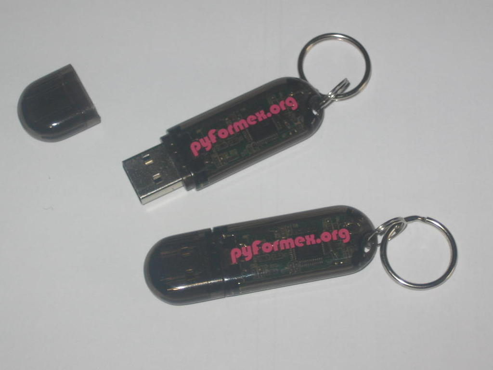

.. $Id$
  
..
  This file is part of pyFormex 0.8.5  (Sun Dec  4 21:24:46 CET 2011)
  pyFormex is a tool for generating, manipulating and transforming 3D
  geometrical models by sequences of mathematical operations.
  Home page: http://pyformex.org
  Project page:  http://savannah.nongnu.org/projects/pyformex/
  Copyright 2004-2011 (C) Benedict Verhegghe (benedict.verhegghe@ugent.be)
  Distributed under the GNU General Public License version 3 or later.
  
  
  This program is free software: you can redistribute it and/or modify
  it under the terms of the GNU General Public License as published by
  the Free Software Foundation, either version 3 of the License, or
  (at your option) any later version.
  
  This program is distributed in the hope that it will be useful,
  but WITHOUT ANY WARRANTY; without even the implied warranty of
  MERCHANTABILITY or FITNESS FOR A PARTICULAR PURPOSE.  See the
  GNU General Public License for more details.
  
  You should have received a copy of the GNU General Public License
  along with this program.  If not, see http://www.gnu.org/licenses/.
  
  

.. include:: defines.inc
.. include:: links.inc

.. _cha:bumpix:

****************************
BuMPix Live GNU/Linux system
****************************

.. topic:: Abstract

   This document gives a short introduction on the BuMPix Live GNU/Linux
   system and how to use it to run pyFormex directly on nearly any
   computer system without having to install it.

.. _sec:what-is-bumpix:

What is BuMPix
==============

`Bumpix Live` is a fully featured GNU/Linux system including pyFormex that
can be run from a single removable medium such as a CD or a USB key.
BuMPix is still an experimental project, but new versions are already
produced at regular intervals. While those are primarily intended for
our students, the install images are made available for download on
the `Bumpix Live GNU/Linux`_ FTP server, so that anyone can use them.

All you need to use the `Bumpix Live GNU/Linux`_ is some proper PC
hardware: the system boots and runs from the removable medium and
leaves everything that is installed on the hard disk of the computer
untouched.

Because the size of the image (since version 0.4) exceeds that of a CD, 
we no longer produce CD-images (.iso) by default, but some older
images remain avaliable on the server. New (reduced) CD
images will only be created on request.
On the other hand, USB-sticks of 2GB and larger have become very
affordable and most computers nowadays can boot from a USB stick.
USB sticks are also far more easy to work with than CD's: you can
create a persistent partition where you can save your changes, while a CD can not be changed.

You can easily take your USB stick with you wherever you go, plug it into any
available computer, and start or continue your previous pyFormex work.
Some users even prefer this way to run pyFormex for that single reason.
The Live system is also an excellent way to test and see what pyFormex can
do for you, without having to install it. Or to demonstrate pyFormex to
your friends or colleagues. 

.. _sec:obtain_bumpix:

Obtain a BuMPix Live bootable medium
====================================

Download BuMPix
---------------
The numbering scheme of the
BuMPix images is independent from the pyFormex numbering. Just pick
the `latest BuMPix image`_ to get the most recent pyFormex available
on USB stick. After you downloaded the .img file, write it to a USB
stick as an image, not as file! Below, you find instructions on how to do
this on a GNU/Linux system or on a Windows platform.

.. warning:: Make sure you've got the device designation correct, or
   you might end up overwriting your whole hard disk! 

Also, be aware that the
USB stick will no longer be usable to store your files under Windows.

Create the BuMPix USB stick under GNU/Linux
-------------------------------------------

If you have an existing GNU/Linux system available, you can write the 
downloaded image to the USB-stick using the command::

  dd if=bumpix-VERSION.img of=USBDEV

where ``bumpix-VERSION.img`` is the downloaded file and USBDEV
is the device corresponding to your USB key. This should be
``/dev/sda`` or ``/dev/sdb`` or, generally, ``/dev/sd?`` where ``?``
is a single character from ``a-z``. The value you should use depends
on your hardware. You can find out the correct value by giving the command ``dmesg``
after you have plugged in the USB key. You will see messages mentioning the
correct ``[sd?]`` device.

The ``dd`` command above will overwrite everything on the specified device,
so copy your files off the stick before you start, and make sure you've got the device designation correct.

Create the BuMPix USB stick under Windows
-----------------------------------------

If you have no GNU/Linux machine available to create the USB key, there
are ways to do this under Windows as well. 
We recommend to use `dd for Windows`_. You can then proceed as follows. 

* Download `dd for Windows`_ to a folder, say ``C:\\download\ddWrite``.

* Download the `latest BuMPix image`_ to the same folder.

* Mount the target USB stick and look for the number of the mounted
  USB. This can be done with the command ``c:\\download\ddWrite dd --list``.
  Look at the description (Removable media) and the size to make sure
  you've got the correct harddisk designation (e.g. ``harddisk1``).

* Write the image to the USB stick with the command, substituting the
  harddisk designation found above::

   dd if=c:\download\ddwrite\bumpix-0.4-b1.img of=\\?\device\harddisk1\partition0 bs=1M --progress

The ``dd`` command above will overwrite everything on the specified device,
so copy your files off the stick before you start, and make sure you've got the device designation correct.

Buy a USB stick with BuMPix
---------------------------

Alternatively,

* if you do not succeed in properly writing the image to a USB key, or
* if you just want an easy solution without any install troubles, or
* if you want to financially support the further development of pyFormex, or
* if you need a large number of pyFormex USB installations,

you may be happy to know that we can provide ready-made BuMPix USB
sticks with the ``pyformex.org`` logo at a cost hardly exceeding that
of production and distribution.
If you think this is the right choice for you, just `email us`_ for a quotation.

.. _sec:boot_bumpix:

Boot your BuMPix system
=======================
Once the image has been written, reboot your computer from the USB
stick. You may have to change your BIOS settings or use the boot menu
to do that. On success, you will have a full GNU/Linux system running,
containing pyFormex ready to use. There is even a start button in the 
toolbar at the bottom.

.. warning:: More detailed documentation on how to use the system is
   currently under preparation. For now, feel free to `email us`_ if
   you have any problems or urgent questions. But first check that your
   question is not solved in the FAQ below.

  

.. _sec:bumpix_faq:

FAQ
===
A collection of hints and answers to frequently asked questions.

#) The initial user name is `user` and the password `live`.

#) On shutdown/reboot, the system pauses with the advice to remove the
   USB stick before hitting `ENTER` to proceed. We advice not to do this 
   (especially when running in *PERSISTENT* mode): instead 
   first hit `ENTER` and remove the USB stick when the screen goes black.

#) BuMPix 0.7.0 may contain a few user configuration files with incorrect
   owner settings. As a result some XFCE configuration may not be permanent.
   To solve the problem, you should run the following command in a terminal ::

      sudo chown -R user:user /home/user

#) For BuMPix 0.7.0 (featuring pyFormex 0.8.4) with XFCE desktop, some users
   have reported occaional problems with starting the window manager. Windows
   remain undecorated and the mouse cursor keeps showing the *BUSY* symbol.
   This is probably caused by an improper previous shutdown and can be resolved
   as follows: open a terminal and enter the command ``xfwm4``. That will start
   up the window manager for your current session and most likely will also
   remove the problem for your next sessions.
  
#) Install the latest pyFormex version from the SVN repository. The BuMPix
   stick contains a script ``pyformex-svn`` under the user's ``bin`` directory
   to install a pyFormex version directly from the SVN repository.
   However, the repository has been relocated to a ne server and the script
   might still contain the old location. You can download a fixed script from
   ftp://bumps.ugent.be/pub/pyformex/pyformex-svn.
 
    

Upgrade the pyFormex version on a BuMPix-0.6.1 USB stick
========================================================

This describes how you can upgrade (or downgrade) the pyFormex version
on your BuMPix 0.6.1 USB key. You need to have network connection to
do this.

* First, we need to fix some file ownerships. Open a Terminal and do
  the following ::

   sudo -i
   chown -R user:user /home/user
   exit

* Then, add your own bin directory to the PATH::

   echo 'export PATH=~/bin:$PATH' >> ~/.bash_profile
  
* Change the configuration of your teminal. Click
  ``Edit -> Profiles -> Edit -> Title and Command``
  and check the option 'Run command as a login shell'.

* Close the terminal and open a new one. Check that the previous
  operation went correct::

   echo $PATH

* This should start with '/home/user/bin'. If ok, then do::
      
   cd bin
   chmod +x pyformex-svn
   ls

* You should now see a green 'pyformex-svn' script. Execute it as follows::

   ./pyformex-svn install makelib symlink
   ls

* If everything went well, you should now also have a blue 'pyformex'
  link. Test it::

   cd ..
   pyformex

* The latest svn version of pyFormex should start. If ok, close it and
  you can make this the default version to start from the pyFormex
  button in the top panel. Right click on the button, then
  'Properties'. Change the Command to::

   bin/pyformex --redirect

* Now you should always have the updated pyformex running, from the
  command line as well as from the panel button. Next time you want to
  upgrade (or downgrade), you can just do::

   cd pyformex-svn
   svn up

* or, for a downgrade, add a specific revision number::

   svn up -r 1833

.. End
