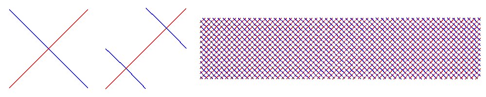

.. $Id$
  
..
  This file is part of pyFormex 0.8.9  (Fri Nov  9 10:49:51 CET 2012)
  pyFormex is a tool for generating, manipulating and transforming 3D
  geometrical models by sequences of mathematical operations.
  Home page: http://pyformex.org
  Project page:  http://savannah.nongnu.org/projects/pyformex/
  Copyright 2004-2012 (C) Benedict Verhegghe (benedict.verhegghe@ugent.be)
  Distributed under the GNU General Public License version 3 or later.
  
  
  This program is free software: you can redistribute it and/or modify
  it under the terms of the GNU General Public License as published by
  the Free Software Foundation, either version 3 of the License, or
  (at your option) any later version.
  
  This program is distributed in the hope that it will be useful,
  but WITHOUT ANY WARRANTY; without even the implied warranty of
  MERCHANTABILITY or FITNESS FOR A PARTICULAR PURPOSE.  See the
  GNU General Public License for more details.
  
  You should have received a copy of the GNU General Public License
  along with this program.  If not, see http://www.gnu.org/licenses/.
  
  

.. include:: defines.inc
.. include:: links.inc

.. _cha:introduction:

************************
Introduction to pyFormex
************************

.. topic:: Abstract

   This part explains shortly what pyFormex is and what it is not.
   It sets the conditions under which you are allowed to use, modify and
   distribute the program. 
   Next is a list of prerequisite software parts that you need to have
   installed in order to be able to run this program. 
   We explain how to download and install pyFormex. 
   Finally, you'll find out what basic knowledge you should have in order
   to understand the tutorial and succesfully use pyFormex.

.. _sec:what-is-pyformex:

What is pyFormex?
=================

You probably expect to find here a short definition of what pyFormex is and
what it can do for you. I may have to disappoint you: describing the essence
of pyFormex in a few lines is not easy to do, because the program can
be (and is being) used for very different tasks. 
So I will give you two answers here: a short one and a long one.

The short answer is that pyFormex is a program to 
*generate large structured sets of coordinates by means of subsequent 
mathematical transformations gathered in a script.* 
If you find this definition too dull, incomprehensible or just not
descriptive enough, read on through this section and look at some of the
examples in this documentation and on the `pyFormex website`_. 
You will then probably have a better idea of what pyFormex is.

The initial intent of pyFormex was the rapid design of three-dimensional
structures with a geometry that can easier be obtained through mathematical
description than through interactive generation of its subparts and
assemblage thereof. Although the initial development of the program
concentrated mostly on wireframe type structures, surface and solid elements
have been part of pyFormex right from the beginning.
There is already an extensive plugin for working with triangulated surfaces, 
and pyFormex is increasingly being used to generate solid meshes of
structures. 
Still, many of the examples included with the pyFormex distribution are of
wireframe type, and so are most of the examples in the :doc:`tutorial`.

A good illustration of what pyFormex can do and what it was intended for is 
the stent [#]_ structure in the figure :ref:`fig:wirestent-example`. 
It is one of the many examples provided with pyFormex.

.. _`fig:wirestent-example`:

.. figure:: images/wirestent.*
   :align: center
   :alt: A wire stent

   WireStent example

The structure is composed of 22032 line segments, each defined by 2 points.
Nobody in his right mind would ever even try to input all the 132192 coordinates
of all the points describing that structure.  
With pyFormex, one could define the structure by the following sequence of
operations, illustrated in the figure :ref:`fig:wirestent-steps`:

#. Create a nearly planar base module of two crossing wires. The wires have a
   slight out-of-plane bend, to enable the crossing.
#. Extend the base module with a mirrored and translated copy.
#. Replicate the base module in both directions to create a (nearly
   planar) rectangular grid.
#. Roll the planar grid into a cylinder.

pyFormex provides all the operations needed to define the geometry in this
way.

.. _`fig:wirestent-steps`:

   First three steps in building the WireStent example

pyFormex does not fit into a single category of traditional (mostly 
commercial) software packages, because it is not being developed as a 
program with a specific purpose, but rather as a collection of tools 
and scripts which we needed at some point in our research projects.
Many of the tasks for which we now use pyFormex could be
done also with some other software package, like a CAD program or a matrix
calculation package or a solid modeler/renderer or a finite element pre- and
postprocessor. Each of these is probably very well suited for the task
it was designed for, but none provides all the features of pyFormex
in a single consistent environment, and certainly not as free software.

.. % \section{Rationale}
.. % \label{sec:rationale}
.. % (e.g. SolidWorks\textregistered)
.. % (MatLab\textregistered{} style)
.. % genre Blender
.. % (such as GiD)

Perhaps the most important feature of pyFormex is that it was
primarily intended to be an easy scripting language for creating
geometrical models of 3D-structures. The graphical user interface
(GUI) was only added as a convenient means to visualize the designed
structure.  pyFormex can still run without user interface, and this
makes it ideal for use in a batch toolchain. Anybody involved in the
simulation of the mechanical behavior of materials and structures
will testify that most of the work (often 80-90%) goes into the
building of the model, not into the simulations itself. Repeatedly
building a model for optimization of your structure quickly becomes
cumbersome, unless you use a tool like pyFormex, allowing for
automated and unattended building of model variants.

The author of  pyFormex, professor in structural engineering and heavy
computer user and programmer since mainframe times, deeply regrets that
computing skills
of nowadays engineering students are often limited to using graphical
interfaces of mostly commercial packages.
This greatly limits their skills, because in their way of thinking: 
'If there is no menu item to do some task, then it can not be done!'
The hope to get some of them back into coding has been a stimulus in
continuing our work on pyFormex. The strength of the scripting language
and the elegance of Python have already attracted many users on this path.

Finally, pyFormex is, and always will be, free software in both meanings
of free: guaranteeing the freedom of the user (see :ref:`sec:license`) and
without charging a fee for it. [#]_

.. % \section{History}
.. % \label{sec:history}

.. _sec:license:

License and Disclaimer
======================

pyFormex is ©2004-|year| Benedict Verhegghe

This program is free software; you can redistribute it and/or modify it under
the terms of the `GNU General Public License`_ (GNU GPL), as published by the `Free Software Foundation`_; either version 3 of the License,
or (at your option) any later version.

The full details of the `GNU GPL`_ are available in the :doc:`license` part of the documentation, in the file COPYING included with the distribution, under the Help->License item of the pyFormex Graphical User Interface or from http://www.gnu.org/copyleft/gpl.html.

This program is distributed in the hope that it will be useful, but WITHOUT ANY
WARRANTY; without even the implied warranty of MERCHANTABILITY or FITNESS FOR A
PARTICULAR PURPOSE.  See the GNU General Public License for more details.

.. _sec:installation:

Installation
============

Information on how to obtain and install pyFormex can be found in the :doc:`install` document.

.. _sec:using:

Using pyFormex
================

Once you have installed and want to start using pyFormex, you will probably
be looking for help on how to do it.

If you are new to pyFormex, you should start with the :doc:`tutorial`, which
will guide you step by step, using short examples, through the basic concepts
of Python, NumPy and |pyFormex|. You have to understand there is a lot to learn
at first, but afterwards the rewards will prove to be huge. You can skip the
sections on Python and NumPy if you already have some experience with it.

If you have used pyFormex before or you are of the adventurous type that does
not want to be told where to go and how to do it, skip the tutorial and go 
directly to the :doc:`user-guide`. It provides the most thorough information
of all aspects of pyFormex. 

Getting Help
============

If you get stuck somewhere with using (or installing) pyFormex and you
need help, the best way is to go to the `pyFormex website`_ and ask for help
via the `Support tracker`_. There's a good change you will get helped quickly
there. Remember though that pyFormex is a free and open source software
project and its developers are not paid to develop or maintain pyFormex, 
they just do this because they find pyFormex very helpful in their normal
daily activities. 

If you are a professional pyFormex user and require guaranteed support,
you can check with `FEops`_, a young company providing services with and
support for pyFormex. [2]_

.. rubric:: Footnotes

.. [#] A stent is a tubular structure that is e.g. used to reopen
   (and keep open) obstructed blood vessels.

.. [#] Third parties may offer pyFormex extensions and/or professional
   support that are fee-based.

.. End
