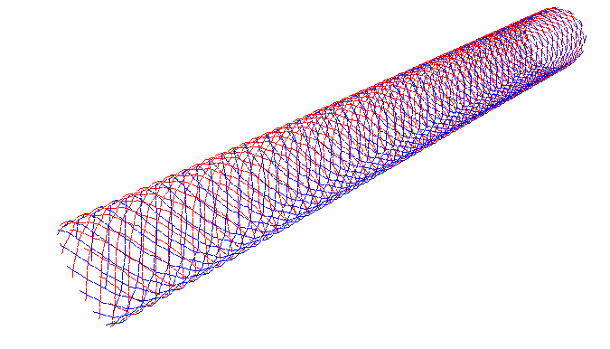

.. $Id$
.. pyformex documentation --- introduction

.. include:: defines.inc
.. include:: ../website/src/links.inc

.. _cha:introduction:

************
Introduction
************

.. topic:: Abstract

   This part explains shortly what |pyformex| is and what it is not.
   It sets the conditions under which you are allowed to use, modify and
   distribute the program. 
   Next is a list of prerequisite software parts that you need to have
   installed in order to be able to run this program. 
   We explain how to download and install |pyformex|. 
   Finally, you'll find out what basic knowledge you should have in order
   to understand the tutorial and succesfully use |pyformex|.

.. _sec:what-is-pyformex:

What is |pyformex|?
===================

You probably expect to find here a short definition of what |pyformex| is and
what it can do for you. I may have to disappoint you: describing the essence
of |pyformex| in a few lines is not an easy task to do, because the program can
be (and is being) used for very different tasks. 
So I will give you two answers here: a short one and a long one.

The short answer is that |pyformex| is a program to 
*generate large structured sets of coordinates by means of subsequent 
mathematical transformations gathered in a script.* 
If you find this definition too dull, incomprehensible or just not
descriptive enough, read on through this section and look at some of the
examples in this documentation and on the website. 
You will then probably have a better idea of what |pyformex| is.

The initial intent of |pyformex| was the rapid design of three-dimensional
structures with a geometry that can easier be obtained through mathematical
description than through interactive generation of its subparts and
assemblage thereof. Although the initial development of the program
concentrated mostly on wireframe type structures, surface and solid elements
have been part of |pyformex| right from the beginning.
There is already an extensive plugin for working with triangulated surfaces, 
and |pyformex| is increasingly being used to generate solid meshes of
structures. 
Still, many of the examples included with the |pyformex| distribution are of
wireframe type, and so are most of the examples in the :doc:`tutorial`.

A good illustration of what |pyformex| can do and what it was intended for is 
the stent [#]_ structure in the figure :ref:`fig:wirestent-example`. 
It is one of the many examples provided with |pyformex|.

.. _`fig:wirestent-example`:

   WireStent example

The structure is composed of 22032 line segments, each defined by 2 points.
Nobody in his right mind would ever even try to input all the 132192 coordinates
of all the points describing that structure.  
With |pyformex|, one could define the structure by the following sequence of
operations, illustrated in the figure :ref:`fig:wirestent-steps`:

* Create a nearly planar base module of two crossing wires. The wires have a
  slight out-of-plane bend, to enable the crossing.

* Extend the base module with a mirrored and translated copy.

* Replicate the base module in both directions of the base plane.

* Roll the planar grid into a cylinder.

|pyformex| provides all the operations needed to define the geometry in this
way.

.. _`fig:wirestent-steps`:

   Steps in building the WireStent example

.. % figure{images/wirestent-1}
.. % figure{images/wirestent-2}
.. % figure{images/wirestent-3}

|pyformex| does not fit into a single category of traditional (mostly 
commercial) software packages, because it is not being developed as a 
program with a specific purpose, but rather as a collection of tools 
and scripts which we needed at some point in our research projects.
Many of the tasks for which we now use |pyformex| could be
done also with some other software package, like a CAD program or a matrix
calculation package or a solid modeler/renderer or a finite element pre- and
postprocessor. Each of these is probably very well suited for the task
it was designed for, but none provides all the features of |pyformex|
in a single consistent environment, and certainly not as free software.

.. % \section{Rationale}
.. % \label{sec:rationale}
.. % (e.g. SolidWorks\textregistered)
.. % (MatLab\textregistered{} style)
.. % genre Blender
.. % (such as GiD)

Perhaps the most important feature of |pyformex| is that it was primarily
intended to be an easy scripting language for creating geometrical models
of 3D-structures. The Graphical User Interface was only added as a convenient
means to visualize the designed structure.
|pyformex| can still run without user interface, and this makes it ideal
for use in a batch toolchain. Anybody involved in the simulation of the
mechanical behaviour of materials and structures will testify that most of the
work (often 80-90%) goes into the building of the model, not into the
simulations itself. Repeatedly building a model for optimization of your
structure quickly becomes cumbersome, unless you use a tool like |pyformex|,
allowing for automated and unattended building of model variants.

The author of  |pyformex|, professor in structural engineering and heavy
computer user since mainframe times, deeply regrets that computing skills
of nowadays engineering students are often limited to using graphical
interfaces of mostly commercial packages.
This greatly limits their skills, because in their way of thinking: 
'If there is no menu item to do some task, then it can not be done!'
The hope to get some of them back into coding has been a stimulus in
continuing our work on |pyformex|. The strength of the scripting language
and the elegance of Python have already attracted many users on this path.

Finally, |pyformex| is, and will always be, free software in both meanings
of free: guaranteeing your freedom (see :ref:`sec:license`) and without
charging a fee for it.

.. % \section{History}
.. % \label{sec:history}

.. _sec:license:

License and Disclaimer
======================

|pyformex| is ©2004-2008 Benedict Verhegghe

This program is free software; you can redistribute it and/or modify it under
the terms of the GNU General Public Licensehttp://www.gnu.org/licenses/gpl.html
as published by the Free Software Foundation; either version 3 of the License,
or (at your option) any later version.

Full details of the license are available in appendix :ref:`sec:license`, in the
file COPYING included with the distribution and under the Help->License item of
the Graphical User Interface.

This program is distributed in the hope that it will be useful, but WITHOUT ANY
WARRANTY; without even the implied warranty of MERCHANTABILITY or FITNESS FOR A
PARTICULAR PURPOSE.  See the GNU General Public License for more details.

.. _sec:installation:

Installation
============

.. _sec:prerequisites:

Prerequisites
-------------

In order to run , you need to have the following installed (and working) on your
computer.

* Python: Version 2.4 or higher is recommended. Versions 2.3 and 2.2 might work
  with only a few minor changes. Nearly all Linux distributions come with Python
  installed, so this should not be no major obstacle.

* NumPy: Version 1.0-rc1 or higher. Earlier versions can be made to work, but
  will require some changes to be made. NumPy is the package used for fast
  numerical array operations in Python and is essential for . [#]_ On Linux
  systems, installing NumPy from source is usually straightforward. Debian users
  can install the package python-numpy.The extra packages python-numpy-ext and
  python-scipy give saom added functionality, but are not required for the basic
  operation of . For Windows, binary packages are available on the Sourceforge
  download pagehttp://www.numpy.org/.

If you only want to use the Formex data model and transformation methods, the
above will suffice. But most probably you will also want to run the Graphical
User Interface (GUI) for visualizing your structures. Then you also need the
following:

* Qt4http://www.trolltech.com/products/qt: The widget toolkit on which the GUI
  was built. For Debian users this  comes in the packages python-qt4.

* PyQt4http://www.riverbankcomputing.co.uk/pyqt/index.php: The Python bindings
  for Qt4. Debian users should install the packages python-qt4 and python-qt4-gl.

* PyOpenGLhttp://pyopengl.sourceforge.net/: Python bindings for OpenGL, used for
  drawing and manipulating the 3D-structures. For debian users this is in the
  package python-opengl.

Since version 0.7, includes an acceleration library that can increase the speed
of some low level operations (e.g. drawing), especially when working on very
large structures. If you want to compile and use this library, you also need to
have a working C compiler and the Python and OpenGL header files. On a Debian
based system, you should install tha packages python-dev, python-qt4-dev and
libgl1-mesa-dev.

.. _sec:downloading:

Downloading
-----------

The official releases of can be downloaded from the  website. As of the writing
of this manual, the latest release is .  is currently distributed in the form of
a .tar.gz (tarball) archive. See :ref:`sec:installation-linux` for how to
proceed further.

Alternatively you can download the tarball releases from our local FTP server.
The server may be slower, but occasionally you can find there an interim release
or release candidate not (yet) available on the official server.

Finally, you can also get the latest development code from the SVN repository on
the website. If you have Subversionhttp://subversion.tigris.org/ installed on
your system, you can just dosvn checkout svn://svn.berlios.de/pyformex/trunk
pyformex and the whole current tree will be copied to a subdirectory
``pyformex`` on your current path.

*Unless you want to help with the development or you absolutely need some of the
latest features or bugfixes, the tarball releases are what you want to go for.
*

.. _sec:installation-linux:

Installation on Linux platforms
-------------------------------

Once you have downloaded the tarball, unpack it with tar xvzf pyformex-
version.tar.gz Then go to the created pyformex directory: cd pyformex-version
and do (with root privileges)  python setup.py install --prefix=/usr/local This
will install under /usr/local/. You can change the prefix to install in some
other place.

The installation procedure installs everything into a single directory, and
creates a symlink to the executable in /usr/local/bin. You can use the command
pyformex --whereami to find out where is installed.

Finally, a installation can usually be removed by giving the command pyformex
--remove and answering 'yes' to the question. You may want to do this before
installing a new version, especially if you install a new release of an already
existing version.

.. _sec:installation-windows:

Installation on Windows platforms
---------------------------------

There is no installation procedure yet. All the pre-requisite packages are
available for Windows, so in theory it is possible to run on Windows. We know of
some users who are running succesfully using the --nogui option, i.e. without
the Graphical User Interface (GUI).   A few things may need to be changed for
running the GUI on Windows. We might eventually have a look at this in the
future, but it certainly is not our primary concern. Still, any feedback on
(successful or not successful) installation attempts on Windows is welcome.

.. _sec:running:

Running
-------

To run , simply enter the command pyformex in a terminal window. This will start
the Graphical User Interface (GUI), from where you can launch examples or load,
edit and run your own scripts.

The installation procedure may have installed into your desktop menu or even
have created a start button in the desktop panel. These provide convenient
shortcuts to start the GUI by the click of a mouse button.

The program takes some optional command line arguments, that modify the
behaviour of the program. Appendix :ref:`cha:commandline` gives a full list of
all options. For normal use however you will seldom need to use any of them.
Therefore, we will only explain here the more commonly used ones.

By default, sends diagnostical and informational messages to the terminal from
which the program was started. Sometimes this may be inconvenient, e.g. because
the user has no access to the starting terminal. You can redirect these messages
to the message window of the GUI by starting pyformex with the command 
``pyformex --redirect``. 
The desktop starters installed by the installation procedure use
this option.

In some cases the user may want to use the mathematical power of without the
GUI. This is e.g. useful to run complex automated procedures from a script file.
For convenience, will automatically enter this batch mode (without GUI) if the
name of a script file was specified on the command line; when a script file name
is absent, start in GUI mode. Even when specifying a script file, You can still
force the GUI mode by adding the option --gui to the command line.

.. _sec:gui-tutorial:

Getting started with the GUI
============================

While the GUI has become much more elaborate in recent versions, its intention
will never be to provide a fully interactive environment to operate on
geometrical data. The first purpose of will always remain to provide an
framework for easily creating scripts to operate on geometries. Automization of
otherwise tedious tasks is our main focus.

The GUI mainly serves the following purposes:

* Display a structure in 3D. This includes changing the viewpoint, orientation
  and viewing distance. Thus you can interactively rotate, translate, zoom.

* Save a view in one of the supported image formats. Most of the images in this
  manual and on the  website were created that way.

* Changing settings (though not everything can be changed through the GUI yet).

* Running scripts, possibly starting other programs and display their results.

* Interactively construct, select, change, import or export geometrical
  structures.

Unlike with most other geometrical modelers, in you usually design a geometrical
model by writing a small script with the mathematical expressions needed to
generate it. Any text editor will be suitable for this purpose. The main author
of uses GNU Emacs, but this is just a personal preference. Any modern text
editor will be fine, and the one you are accustomed with, will probably be the
best choice. Since Python is the language used in scripts, a Python aware editor
is highly preferable. It will highlight the syntax and help you with proper
alignment (which is very important in Python). The default editors of KDE and
Gnome and most other modern editors will certainly do well.  A special purpose
editor integrated into the GUI is on our TODO list, but it certainly is not our
top priority, because general purpose editors are already adequate for our
purposes.

Learning how to use is best done by studying and changing some of the examples.
We suggest that you first take a look at the examples included in the GUI and
select those that display geometrical structures and/or use features that look
interesting to you. Then you can study the source code of those examples and see
how the structures got built and how the features were obtained. Depending on
your installation and configuration, the examples can be found under the
:menuselection:`Examples` or :menuselection:`Scripts` main menu item. The
examples may appear classified according to themes or keywords, which can help
you in selecting appropriate examples.

Selecting an example from the menu will normally execute the script, possibly
ask for some interactive input and display the resulting geometrical structure.
To see the source of the script, choose the :menuselection:`File --> Edit
Script` menu item.

Before starting to write your own scripts, you should probably get acquainted
with the basic data structures and instructions of Python, NumPy and .

.. _sec:python-tutorial:

Quick Python tutorial
=====================

is written in the Python language, and Python is also the scripting language of
. Since the intent of is to design structures by using scripts, you will at
least need to have some basic knowledge of Python before you can use for your
own projects.

There is ample documentation about Python freely available on the web.  If you
are new to Python, but have already some programming experience, the Python
tutorial may be a good starting point. Or else, you can take a look at one of
the beginners' guides.

Do not be be afraid of having to learn a new programming language: Python is
known as own of the easiest languages to get started with: just a few basic
concepts suffice to produce quite powerful scripts. Most developers and users of
have started without any knowledge of Python.

To do: Introduce the (for users) most important Python concepts.

.. _sec:numpy-tutorial:

Quick NumPy tutorial
====================

Numerical Python (or NumPy for short) is an extension to the Python language
providing efficient operations on large (numerical) arrays. relies heavily on
NumPy, and most likely you will need to use some NumPy functions in your
scripts. As NumPy is still quite young, the available documentation is not so
extensive yet. Still, the tentative NumPy
tutorialhttp://www.scipy.org/Tentative_NumPy_Tutorial already provides the
basics.

If you have ever used some other matrix language, you will find a lot of similar
concepts in NumPy.

To do: Introduce the (for users) most important NumPy concepts.

How to proceed from here
========================

By now, you should have enough basic knowledge about Python and NumPy to
continue by studying the tutorial in chapter :ref:`cha:tutorial`.

.. rubric:: Footnotes

.. [#] A stent is a tube-shaped structure that is e.g. used to reopen
   (and keep open) obstructed blood vessels.

.. [#] The ``Numarray`` package, which was used up until 0.3, is no longer
   supported.

.. End
