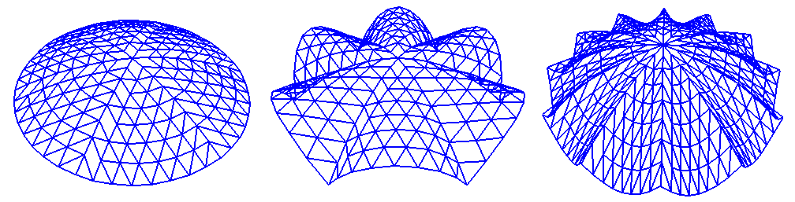
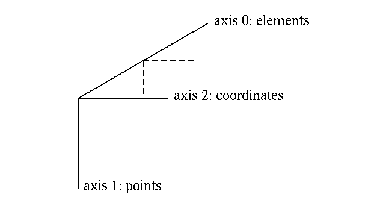
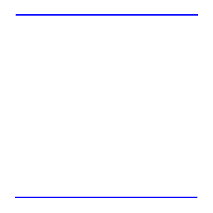
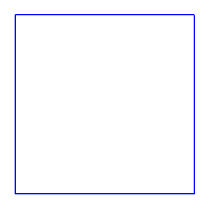
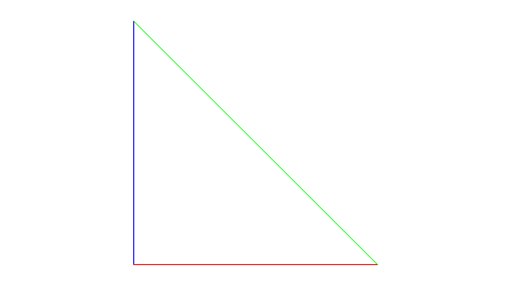

.. $Id$
.. pyformex documentation --- tutorial

.. include:: defines.inc
.. include:: ../website/src/links.inc

.. _cha:tutorial:

*****************
pyFormex tutorial
*****************

.. warning:: This document is currently under revision! 

.. _sec:intro-tut:

The philosophy
==============

is a Python implementation of Formex algebra. Using |pyformex|, it is very 
easy to generate large geometrical models of 3D structures by a sequence of 
mathematical transformations. 
It is especially suited for the automated design of spatial
structures. But it can also be used for other tasks, like operating on 3D
geometry obtained from other sources, or for finite element pre- and
postprocessing, or just for creating some nice pictures.

By writing a simple script, a large and complex geometry can be created by
copying, translating, rotating, or otherwise transforming geometrical entities.
|pyformex| will interpret the script and draw what you have created. 
This is clearly very different from the traditional (mostly interactive) way
of creating a geometrical model, like is done in most CAD packages.
There are some huge advantages in using |pyformex|:

* It is especially suited for the automated design of spatial frame structures.
  A dome, an arc, a hypar shell, ..., when constructed as a space frame, can be
  rather difficult and tedious to draw with a general CAD program; 
  using scripted mathematical transformations however, it may become a
  trivial task.

* Using a script makes it very easy to apply changes in the geometry:
  you simply modify the script and re-execute it. You can easily
  change the value of a geometrical parameter in any way you want:
  set it directly, interactively ask it from the user, calculate it from some
  formula, read it from a file, etcetera. 
  Using CAD, you would have often have to
  completely redo your drawing work. The power of scripted geometry
  building is illustrated in figure :ref:`fig:scallopdomes`: all these
  domes were created with the same script, but with different values
  of some parameters.

.. _`fig:scallopdomes`:

   Same script, different domes

* At times there will be operations that are easier to perform through
  an interactive Graphical User Interface (GUI). The GUI gives access
  to many such functions. Especially occasional and untrained users
  will benefit from it. As everything else in |pyformex|, the GUI is completely
  open and can be modified at will by the user's application scripts,
  to provide an interface with either extended or restricted
  functionality. 

* \pyformex scripts are written in the `Python`_ programming language.
  This implies that the scripts are also Python-based. It is a very
  easy language to learn, and if you are interested in reading more
  about it, there are good tutorials and beginner's guides available
  on the Python website (http://www.python.org/doc). However, if
  you're only using Python to write |pyformex| scripts, the tutorial
  you're reading right now should be enough.

.. _sec:getting-started:

Getting started
===============

* Start the |pyformex| GUI by entering the command ``pyformex`` in a
  terminal. Depending on your instalation, there may also be a menu
  item in the application menu to start |pyformex|, or even a quickstart button
  in the panel. Using the terminal however can still be useful,
  especially in the case of errors, because otherwise the GUI might
  suppress some of the error messages that normally are sent to the
  terminal.

* Create a new |pyformex| script using the
  :menuselection:`File-->Create new script` option, and enter a filename
  with extension ``.py``. This will open up your favorite editor with
  a |pyformex| script template like the one below.

  .. literalinclude:: _static/scripts/template.py
   :language: python
   :linenos:

.. warning:: If the editor does not open, you may need to configure
   the editor command:  see :ref: `Settings --> Commands <settings-commands>`.

* The template script shows the typical layout of a |pyformex| script:

  - The script starts with a line ``#!/usr/bin/env pyformex``.
  - Then comes a multiline documentation string, contained between two ``"""`` 
    delimiters. Read it: it repeats this instructions on how a legal
    |pyformex| script should be structured.
  - Next are the |pyformex| instructions: in this case there's only one line.
  - The script ends with a comment line ``# End``. We recommend you to do this
    also. It serves as a warning for inadvertent truncation of your file.

* In the status bar at the bottom of the |pyformex| GUI, you will now
  see the name of the script, together with a green dot. This tells
  you that the script has been recognized by the system as a
  |pyformex| script, and is ready to run.

* Execute the script by selecting the :menuselection:`File --> Play`
  menu option, or by just pushing the |button-play| button in the
  toolbar. In the message area just above the status bar, a line is
  printed announcing the start and end of execution. Any output created
  by the script during execution will be displayed in between this two
  lines. As expected, the template script just prints the text from line 16
  of the script.

* Now change the text of the string in line 16, but do not save your changes.
  Execute the script again, and notice that the printed text has not changed!
  This is because the editor is an external program to |pyformex|, and *the 
  executed script is always the text as read from file*, not necessarily equal
  to what is displayed in your editor.

  Save the script, run it again, and you will see the output has changed.

* Next, change the text of the script to look like the one below, and save it as
  ``example1.py``. Again, note that the editor and |pyformex| are separate 
  programs, and saving the script does not change the name of the current
  script in |pyformex|.

  Selecting an existing script file for execution in |pyformex| is done with
  the :menuselection:`File --> Open` option. Open the ``example1.py`` file
  you just saved and check that its name is indeed displayed in the status bar.
  You can now execute the script if you want, but it will not produce anything
  visible. 

  .. literalinclude:: _static/scripts/example1.py
   :language: python
   :linenos:

* Exit |pyFormex| (using the :menuselection:`File --> Exit`) and then restart
  it. You should again see the ``example1.py`` displayed as the current script.
  On exit, |pyformex| stores your last script name, and on restart it prepares
  to run it again. You can also easily select one the most recent scripts you
  used from the :menuselection:`File --> History` option. Select the oldest
  (bottom) one. Then close all your editor windows.

* Open the ``example1.py`` again, either using :menuselection:`File --> Open`
  or :menuselection:`File --> History`. The script will not be loaded into your
  editor. That is becaused often you will just want to *run* the script, not
  *change* it. Use the :menuselection:`File --> Edit` option to load the
  current script into the editor.

Now that you know how to load, change and execute scripts in |pyformex|, we're
all set for exploring its power. But first, let's introduce you to Python and NumPy.

.. _sec:intro-python:

Short introduction to Python
============================

.. warning:: This section is to be rewritten!

* When writing a script in Python, there are some things you should keep in
  mind:

* When using a function that requires arguments, an argument list must have any
    positional arguments followed by any keyword arguments, where the keywords must
    be chosen from the formal parameter names. It's not important whether a formal
    parameter has a default value or not. No argument may receive a value more than
    once -- formal parameter names corresponding to positional arguments cannot be
    used as keywords in the same calls.

    Simply put: you can either set the arguments in the right order and only give
    their value, or you can give arguments by their name and value. This last option
    holds some advantages: not only is it easier to check what you did, but
    sometimes a function has many arguments with default values and you only want to
    change a few. If this isn't entirely clear yet, just look at the examples later
    in this tutorial or check the Python tutorial.

* Indentation is essential in Python. Indentation is Python's way of grouping
    statements. In straight-forward scripts, indentation is not needed (and
    forbidden!), but when using a for-statement for example, the body of the
    statement has to be indented. A small example might make this clear. Also notice
    the ':'   ::

       print 'properties'
       for key, item in properties.iteritems():
           print key, item

* If you want to use functions from a seperate module (like :mod:`properties`),
    you add a line on top of the script  ::

       from properties import *

    All functions from that module are now available.

* The hash character, "#", is used to start a comment in Python.

* Python is case sensative.

* Python by default uses integer math on integer arguments!

.. _sec:intro-numpy:

Short introduction to NumPy
===========================

.. warning:: This section is still to be written!

.. index:: single: ndarray

|pyformex| uses the NumPy :class:`ndarray` as implementation of fast 
numerical arrays in Python.

.. _sec:geom:

Creating geometrical models
===========================

.. _sec:formex:

The Formex data model
---------------------

.. index::
   single: Formex
   single: plexitude

The most important geometrical object in |pyformex| is the
:class:`Formex` class. A :class:`Formex` (plural:Formices) can
describe a variety of geometrical objects: points, lines, surfaces,
volumes. The most simple geometrical object is the point, which in
three dimensions is only determined by its coordinates ``(x,y,z)``,
which are numbered ``(0,1,2)`` in |pyformex| to be consistent with
Python and NumPy indexing.  Higher order geometrical objects are
defined as a collection of points.  The number of points of an object
is called the *plexitude* of the object.

.. index:: single: element

A Formex is a collection of geometrical objects of the same plexitude. The
objects in the collection are called the *elements* of the :class:`Formex`. A
:class:`Formex` whose elements have plexitude :math:`n` is also called an
:math:`n`\ -plex :class:`Formex`. Internally, the coordinates of the points are
stored in a NumPy :class:`ndarray`  with three dimensions. The coordinates of a
single point are stored along the last axis (2) of the :class:`Formex`; all the
points of an element are stored along the second axis (1); different elements
are stored along the first axis (0) of the :class:`Formex`. The figure
:ref:`fig:formex` schematizes the structure of a :class:`Formex`.

.. _`fig:formex`:

   The structure of a Formex

.. warning::

   The beginning user should be aware not to confuse the three axes of
   a :class:`Formex` with the axes of the 3D space. Both are numbered
   0..2. The three coordinate axes form the components of the last
   axis of a Formex.

For simplicity of the implemented algorithms, internally |pyformex|
only deals with 3D geometry. This means that the third axis of a
:class:`Formex` always has length 3. You can however import 2D
geometry: all points will be given a third coordinate
:math:`z=0.0`. If you restrict your operations to transformations in
the :math:`(x,y)`\ -plane, it suffices to extract just the first two
coordinates to get the transformed 2D geometry.

The :class:`Formex` object ``F`` can be indexed just like a :math:`NumPy`
numerical array: ``F[i]`` returns the element with index :math:`i` (counting
from :math:`0`). For a :class:`Formex` with plexitude :math:`n`, the result will
be an array with shape :math:`(n,3)`, containing all the points of the element.
Further, ``F[i][j]`` will be a :math:`(3,)`\ -shaped array containing the
coordinates of point :math:`j` of element :math:`i`. Finally, ``F[i][j][k]`` is
a single floating point value representing one coordinate of that point.

.. % A plane along the axes 2 and 1 is a set of points (F: cantle). This can be
.. % thought of as a geometrical shape (2 points form a line segment, 3 points
.. % make a triangle, ...) or as an element in FE terms. But it really is up to
.. % the user as to how this set of points is to be interpreted.
.. % Finally, the whole Formex represents a set of such elements.
.. % Additionally, a Formex may have a property set, which is an 1-D array of
.. % integers. The length of the array is equal to the length of axis 0 of the
.. % Formex data (i.e. the number of elements in the Formex). Thus, a single
.. % integer value may be attributed to each element. It is up to the user to
.. % define the use of this integer (e.g. it could be an index in a table of
.. % element property records).
.. % If a property set is defined, it will be copied together with the Formex
.. % data whenever copies of the Formex (or parts thereof) are made.
.. % Properties can be specified at creation time, and they can be set,
.. % modified or deleted at any time. Of course, the properties that are
.. % copied in an operation are those that exist at the time of performing
.. % the operation.

.. _subsec:create:

Creating a Formex 
----------------- 

There are many, many ways to create :class:`Formex` instances in your
scripts.  Most of the geometrical operations and transformations in
|pyformex| return geometry as a :class:`Formex`. But how do you create
a new geometric structure from simple coordinate data? Well, there are
several ways to do that too, and we'll introduce them one by one.

Creating a Formex from structured coordinate data
^^^^^^^^^^^^^^^^^^^^^^^^^^^^^^^^^^^^^^^^^^^^^^^^^
The most straightforward way to create a Formex is by specifying the coordinates of the points of all its elements in a way compatible to creating a 3D :class:`ndarray`::

   F = Formex([[[0.,0.],[1.,0.]],[[1.,1.],[0.,1.]]])

The data form a nested list of three levels deep. Each innermost level list
holds the coordinates of a single point. There are four of them: [0.,0.], [1.,0.], [1.,1.] and [0.,1.]. Remark that we left out the third (z) coordinate and it will be set equal to zero. Also, though the values are integer, we added a dot
to force floating point values.

.. note::
   We advice you to always write the decimal point in values that initialize
   variables that can have floating point values, such as lengths, angles,
   thicknesses. Use integer values only to initialize variables that can
   only have an integer value, such as the number of elements.

The second list level groups the points into elements. In this case there are
two elements, each containing two points. The outermost list level then is the :class:`Formex`: it has plexitude 2 and contains 2 elements. 
But what geometrical entities does this represent?

.. _`fig:square`:

   A very simple  Formex

On the other hand, if you change the
position of the square brackets like in the following example, then you'd create
a Formex F which is different from the previous. The nodes are the same, but the
connection is different. The nodes (0,0) and (1,0) are linked together by an
element, and so are the nodes (1,1) and (0,1). The Formex is now a set of 2
parallel bars, instead of a single square plane.

::

   F=Formex([[[0,0],[1,0],[1,1],[0,1]]])

If we want to define a Formex, similar to the square plane, but consisting of
the 4 edges instead of the actual plane, we have to define four elements and
combine them in a Formex. This is *not* the same Formex as fig
:ref:`fig:square`, although it looks exactly the same.

.. _`fig:square`:

   A very simple  Formex

.. % \begin{figure}[ht]
.. % \centering
.. % \begin{makeimage}
.. % \end{makeimage}
.. % \begin{latexonly}
.. % \includegraphics[width=4cm]{images/parallel}
.. % \end{latexonly}
.. % \begin{htmlonly}
.. % \htmladdimg{../images/parallel.png}
.. % \end{htmlonly}
.. % \caption{Same nodes, different Formex}
.. % \end{figure}

::

   F=Formex([[[0,0],[0,1]], [[0,1],[1,1]], [[1,1],[1,0]], [[1,0],[0,0]]])

The previous examples were limited to a 2-D environment for simplicity's sake.
Of course, we could add a third dimension. For instance, it's no problem
defining a pyramid consisting of 8 elements ('bars').  ::

   F=Formex([[[0,0,0],[0,1,0]], [[0,1,0],[1,1,0]], [[1,1,0],[1,0,0]], [[1,0,0], 
   	[0,0,0]], [[0,0,0],[0,1,0]], [[0,0,0],[0.5,0.5,1]], [[1,0,0],[0.5,0.5,1]], 
   	[[1,1,0], [0.5,0.5,1]], [[0,1,0],[0.5,0.5,1]]])

However, as you can see, even in this very small example the number of nodes,
elements and coordinates you have to declare becomes rather large. Defining
large Formices using this method would not be practical. This problem is easily
overcome by copying, translating, rotating,... a smaller Formex --- as will be
explained in :ref:`subsec:changing` --- or by using patterns.

.. % \begin{figure}[ht]
.. % \centering
.. % \begin{makeimage}
.. % \end{makeimage}
.. % \begin{latexonly}
.. % \includegraphics[width=6cm]{images/pyramide}
.. % \end{latexonly}
.. % \begin{htmlonly}
.. % \htmladdimg{../images/pyramide.png}
.. % \end{htmlonly}
.. % \caption{A pyramid}
.. % \label{fig:pyramid}
.. % \end{figure}

Creating a Formex using patterns
^^^^^^^^^^^^^^^^^^^^^^^^^^^^^^^^

Another way of creating a Formex, is by using the coordinate generating
functions :func:`pattern` and mpattern. These functions create a series of
coordinates from a simple string, by interpreting each of the characters of the
string as a single unit step in one of the cordinate directions, or as some
other simple action. These functions thus are very valuable in creating geometry
where the points lie on a regular grid.

In this case, a line segment pattern is created from a string.

The function :func:`pattern(s)` creates a list of line segments where all nodes
lie on the gridpoints of a regular grid with unit step. The first point of the
list is [0,0,0]. Each character from the given string *s* is interpreted as a
code specifying how to move to the next node. Currently defined are the
following codes: ---  0 = goto origin [0,0,0] ---  1..8 move in the x,y plane
---  9 remains at the same place ---  When looking at the plane with the x-axis
to the right, ---  1 = East, 2 = North, 3 = West, 4 = South, 5 = NE, 6 = NW, 7 =
SW, 8 = SE. ---  Adding 16 to the ordinal of the character causes an extra move
of +1 in the z-direction. Adding 48 causes an extra move of -1. This means that
'ABCDEFGHI', resp. 'abcdefghi', correspond with '123456789' with an extra z +/-=
1.               The special character '``\``' can be put before any character
to make the move without making a connection. The effect of any other character
is undefined.

This method has important restrictions, since it can only create lines on a
regular grid. However, it can be a much easier and shorter way to define a
simple Formex. This is illustrated by the difference in length between the
previous creation of a square and the next one, although they define the same
Formex (figure :ref:`fig:square`).  ::

   F=Formex(pattern('1234'))

Some simple patterns are defined in :mod:`simple.py` and are ready for use.
These patterns are stacked in a dictionary called 'Patterns'. Items of this
dictionary can be accessed like Patterns['cube'].  ::

   #!/usr/bin/env pyformex
   from simple import *
   c=Formex(pattern(Pattern['cube']))
   clear();draw(c)

.. % \begin{figure}[ht]
.. % \centering
.. % \begin{makeimage}
.. % \end{makeimage}
.. % \begin{latexonly}
.. % \includegraphics[width=6cm]{images/cube}
.. % \end{latexonly}
.. % \begin{htmlonly}
.. % \htmladdimg{../images/cube.png}
.. % \end{htmlonly}
.. % \caption{A cube}
.. % \label{fig:cube}
.. % \end{figure}

Creating a Formex using coordinates from a file
^^^^^^^^^^^^^^^^^^^^^^^^^^^^^^^^^^^^^^^^^^^^^^^

In some cases, you might want to read coordinates from a file an combine them
into a Formex. This is possible with the module :mod:`file2formex` and it's
function :func:`fileFormex`. Each point is connected to the following, forming
an element (bar).

The next file ('square.txt') would create the same square as before(figure
:ref:`fig:square`).  ::

   0,0,0
   0,1,0
   1,1,0
   1,0,0

::

   #!/usr/bin/env pyformex
   from file2formex import *
   F=fileFormex('square.text', closed='yes')

Drawing a Formex
----------------

.. _subsec:drawing:

Of course, you'd want to see what you have created. This is accomplished by the
function :func:`draw`. The next example creates figure :ref:`fig:pyramid`.   ::

   F=Formex([[[0,0,0],[0,1,0]], [[0,1,0],[1,1,0]], [[1,1,0],[1,0,0]], [[1,0,0], 
   	[0,0,0]], [[0,0,0],[0,1,0]], [[0,0,0],[0.5,0.5,1]], [[1,0,0],[0.5,0.5,1]], 
   	[[1,1,0], [0.5,0.5,1]], [[0,1,0],[0.5,0.5,1]]])
   draw(F)

It also possible to draw multiple Formices at the same time.  ::

   from simple import *
   F=Formex([[[0,0,0],[0,1,0]], [[0,1,0],[1,1,0]], [[1,1,0],[1,0,0]], [[1,0,0],
   	[0,0,0]], [[0,0,0],[0,1,0]], [[0,0,0],[0.5,0.5,1]], [[1,0,0],[0.5,0.5,1]], 
   	[[1,1,0],[0.5,0.5,1]], [[0,1,0],[0.5,0.5,1]]]).setProp(1)	
   G=Formex(pattern(Pattern['cube'])).setProp(3)
   draw(F+G)

It might be important to realize that even if you don't draw a particular
Formex, that doesn't mean you didn't create it!

.. % \begin{figure}[ht]
.. % \centering
.. % \begin{makeimage}
.. % \end{makeimage}
.. % \begin{latexonly}
.. % \includegraphics[width=6cm]{images/house}
.. % \end{latexonly}
.. % \begin{htmlonly}
.. % \htmladdimg{../images/house.png}
.. % \end{htmlonly}
.. % \caption{Drawing multiple Formices}
.. % \label{fig:multiple}
.. % \end{figure}

Now, when you are creating a large geometry, you might be interested in seeing
the different steps in the creation. To remove all previously drawn Formices,
you can use :func:`clear`  what sweepes the screen clean. If you want to see a
certain step in the creation longer than the default time, use :func:`sleep(t)`,
with *t* the delay (in seconds) before executing the next command.  ::

   F=Formex(pattern('164'))
   draw(F)
   G=F.replic(5,1,0)
   clear()
   draw(G)

.. _subsec:propnr:

Adding property numbers
-----------------------

Apart from the coordinates of its points, a Formex object can also store a set
of property numbers. This is a set of integers, one for every element of the
Formex. The property numbers are stored in an attribute :attr:`p` of the Formex.
They can be set, changed or deleted, and be used for any purpose the user wants,
e.g. to number the elements in a different order than their appearence in the
coordinate array. Or they can be used as pointers into a large database that
stores all kind of properties for that element. Just remember that a Formex
either has no property numbers, or a complete set of numbers: one for every
element.

Property numbers can play an important role in the modelling process, because
they present some means of tracking how the resulting Formex was created.
Indeed, each transformation of a Formex that preserves its structure, will also
preserve the property numbers. Concatenation of Formices with property numbers
will also concatenate the property numbers. If any of the concatenated Formices
does not have property numbers, it will receive value 0 for all its elements. If
all concatenated Formices are without properties, so will be the resulting
Formex.

On transformations that change the structure of the Formex, such as replication,
each element of the created Formex will get the property number of Formex
element it was generated from.

To create a Formex with property numbers, just specify them as a second argument
in the constructor. The following example creates a Formex consisting of two
triangles, one with property number 1, the second with property 3. The following
lines show the creation of the four Formices displayed in figure
:ref:`fig:props`, where elements with proprty value 1 are shown in red, those
with property value 3 are shown in blue.   ::

   >>> F0 = Formex(mpattern('12-34'),[1,3])
   >>> F1 = F0.replic2(4,2)
   >>> F2 = F1 + F1.mirror(1)
   >>> F3 = F2 + F2.rotate(180.,1)

To create the properties on a Formex without, you should always use the
:meth:`setProp` method. This ensures that the properties array is generated with
the correct type and shape. If needed, the supplied values will be repeated to
match the number of elements in the Formex. Once the :attr:`p` attribute is
created, you can safely change the value of any of the property numbers.

.. % \begin{figure}[ht]
.. % \centering
.. % \begin{makeimage}
.. % \end{makeimage}
.. % \begin{latexonly}
.. % \includegraphics[width=10cm]{images/props}
.. % \end{latexonly}
.. % \begin{htmlonly}
.. % \htmladdimg{../images/props.png}
.. % \end{htmlonly}
.. % \caption{A Formex with property numbers drawn as colors}
.. % \label{fig:props}
.. % \end{figure}

::

   >>> F = Formex(mpattern('12-34-32-14'))
   >>> F.setProp([1,3])
   >>> print F.p
       [1 3 1 3]
   >>> F.p[2] = 5
   >>> print F.p
       [1 3 5 3]   

When drawing a Formex having property numbers with default draw options (i.e. no
color specified), pyFormex will use the property numbers as indices in a color
table, so different properties are shown in different colors. The default color
table has eight colors: ``[ black, red, green, blue, cyan, magenta, yellow,
white]`` and will wrap around if a property value larger than 7 is used. You can
however specify any other and larger colorset to be used for drawing the
property colors.

Saving images
-------------

.. _subsec:images:

After drawing the Formex, you might want to save the image. This is very easy to
do: ---  :menuselection:`File --> Save Image` ---  The filetype should be 'bmp',
'jpg', 'pbm', 'png', 'ppm', 'xbm', 'xpm', 'eps', 'ps', 'pdf' or 'tex'.  ---  To
create a better looking picture, several settings can be changed:

* Change the background color :menuselection:`Settings --> Background Color`

* Use a different (bigger) linewidth :menuselection:`Settings --> Linewidth`

* Change the canvas size. This prevents having to cut and rescale the figure
  with an image manipulation program (and loosing quality by doing so).
  :menuselection:`Settings --> Canvas Size`

It is also possible to save a series of images. This can be especially useful
when playing a script which creates several images, and you would like to save
them all.  For example, figure :ref:`fig:wirestent-steps`, which shows the
different steps in the creation of the WireStent model, was created this way.
---  :menuselection:`File --> Toggle MultiSave` ---

.. _subsec:info:

Information about a Formex
--------------------------

The Formex class has several methods related to abtaining information obout the
object. We refer to the reference manual in chapter :ref:`cha:reference` for a
full list. Some of the most interesting and often used ones are:

+-------------------+----------------------------------------------+
| Function          | Description                                  |
+===================+==============================================+
| :exc:`F.nelems()` | Return the number of elements in the Formex. |
+-------------------+----------------------------------------------+
| :exc:`F.nplex()`  | Return the plexitude (the number of point in |
|                   | each element) of the Formex.                 |
+-------------------+----------------------------------------------+
| :exc:`F.prop()`   | Return the properties array (same as F.p).   |
+-------------------+----------------------------------------------+
| :exc:`F.bbox()`   | Return the bounding box of the Formex.       |
+-------------------+----------------------------------------------+
| :exc:`F.center()` | Return the center of the Formex.             |
+-------------------+----------------------------------------------+

.. _subsec:changing:

Changing the Formex
-------------------

Until now, we've only created simple Formices. The strength of however is that
it is very easy to generate large geometrical models by a sequence of
mathematical transformations. After initiating a basic Formex, it's possible to
transform it by using copies, translations, rotations, projections,...

There are many transformations available, but this is not the right place to
describe them all. This is what the reference manual in chapter
:ref:`cha:reference` is for. A summary of all possible transformations and
functions can be found there.

To illustrate some of these transformations and the recommended way of writing a
script, we will analyse some of the examples. More of these interesting examples
are found in :file:`installdir/examples`. Let's begin with the example
:file:`Spiral.py`.

.. include:: _static/scripts/Spiral.py
   :literal:

During this first read-through, you will have noticed that every step is drawn.
Of course, this is not necessary, but it can be useful. And above all, it is
very educational for use in a tutorial...

The next important thing is that parameters were used. It's recommended to
always do this, especially when you want to do a parametric study of course, but
it can also be very convenient if at some point you want to change the geometry
(for example when you want to re-use the script for another application).

A simple function :func:`drawit` is defined for use in this script only. This
function only provides a shorter way of drawing Formices, since it combines
:func:`clear` and :func:`draw`.

Now, let's dissect the script. ::

   def drawit(F,view='front'):
       clear()
       draw(F,view)

This is a small function that is only defined in this script. It clears the
screen and draws the Formex at the same time.  ::

   m = 36 # number of cells along torus big circle
   n = 10 # number of cells along torus small circle

These are the parameters. They can easily be changed, and a whole new spiral
will be created without any extra effort. The first step is to create a basic
Formex. In this case, it's a triangle which has a different property number for
every edge.  ::

   F = Formex(pattern("164"),[1,2,3]); drawit(F)  

.. _`fig:basic-formex`:

   The basic Formex

This basic Formex is copied 'm' times in the 0-direction with a translation
step of '1' (the length of an edge of the triangle). After that, the new  Formex
is copied 'n' times in the 1-direction with a translation step of '1'.  Because
of the recursive definition (F=F.replic), the original Formex F is  overwritten
by the transformed one.  ::

   F = F.replic(m,1,0); drawit(F)
   F = F.replic(n,1,1); drawit(F)

Now a copy of this last Formex is translated in direction '2' with a
translation step of '1'. This necessary for the transformation into a cilinder.
The result of all previous steps is a rectangular pattern with the desired
dimensions, in a plane z=1.  ::

   F = F.translate(2,1); drawit(F,'iso')

This pattern is rolled up into a cilinder around the 2-axis.

.. % \begin{figure}[ht]
.. % \centering
.. % \begin{makeimage}
.. % \end{makeimage}
.. % \begin{latexonly}
.. % \includegraphics[width=6cm]{images/spiral-003}
.. % \end{latexonly}
.. % \begin{htmlonly}
.. % \htmladdimg{../images/spiral-003.png}
.. % \end{htmlonly}
.. % \caption{The rectangular pattern}
.. % \end{figure}

::

   F = F.cylindrical([2,1,0],[1.,360./n,1.]); drawit(F,'iso')

This cilinder is copied 5 times in the 2-direction with a translation step of
'm' (the lenght of the cilinder).

.. % \begin{figure}[ht]
.. % \centering
.. % \begin{makeimage}
.. % \end{makeimage}
.. % \begin{latexonly}
.. % \includegraphics[width=6cm]{images/spiral-004}
.. % \end{latexonly}
.. % \begin{htmlonly}
.. % \htmladdimg{../images/spiral-004.png}
.. % \end{htmlonly}
.. % \caption{The cylinder}
.. % \end{figure}

::

   F = F.replic(5,m,2); drawit(F,'iso')

The next step is to rotate this cilinder -10 degrees around the 0-axis.  This
will determine the pitch angle of the spiral.  ::

   F = F.rotate(-10,0); drawit(F,'iso')

This last Formex is now translated in direction '0' with a translation step of
'5'.

.. % \begin{figure}[ht]
.. % \centering
.. % \begin{makeimage}
.. % \end{makeimage}
.. % \begin{latexonly}
.. % \includegraphics[width=6cm]{images/spiral-006}
.. % \end{latexonly}
.. % \begin{htmlonly}
.. % \htmladdimg{../images/spiral-006.png}
.. % \end{htmlonly}
.. % \caption{The new cylinder}
.. % \end{figure}

::

   F = F.translate(0,5); drawit(F,'iso')

Finally, the Formex is rolled up, but around a different axis then before.  Due
to the pitch angle, a spiral is created. If the pitch angle would be 0  (no
rotation of -10 degrees around the 0-axis), the resulting Formex  would be a
torus.   ::

   F = F.cylindrical([0,2,1],[1.,360./m,1.]); drawit(F,'iso')
   drawit(F,'right')

.. % \begin{figure}[ht]
.. % \centering
.. % \begin{makeimage}
.. % \end{makeimage}
.. % \begin{latexonly}
.. % \includegraphics[width=5cm]{images/spiral-007}
.. % \includegraphics[width=5cm]{images/spiral-008}
.. % \end{latexonly}
.. % \begin{htmlonly}
.. % \htmladdimg{../images/spiral-007.png}
.. % \htmladdimg{../images/spiral-008.png}
.. % \end{htmlonly}
.. % \caption{The spiral}
.. % \end{figure}

.. _subsec:femodel:

Converting a Formex to a Finite Element model
---------------------------------------------

The :meth:`feModel` method is important in exporting the geometry to finite
element (FE) programs. A Formex often contains many points with (nearly) the
same coordinates. In a finite element model, theses points have to be merged
into a single nod, to express the continuity of the material. This is exactly
what\ :meth:`feModel` does. It returns a tuple of two numpy arrays
(nodes,elems), where

* nodes is a float array with shape (?,3), containing the coordinates of the
  merged points (nodes),

* elems is an integer array with shape (F.nelems(),F.nplex()), describing each
  element by a list of node numbers. The elements and their nodes are in the same
  order as in F.

::

   >>> from simple import *
   >>> F = Formex(pattern(Pattern['cube']))
   >>> draw(F)
   >>> nodes,elems = F.feModel()
   >>> print 'Nodes',nodes
   >>> print 'Elements',elems

   Nodes
   [[ 0.  0.  0.]
    [ 1.  0.  0.]
    [ 0.  1.  0.]
    [ 1.  1.  0.]
    [ 0.  0.  1.]
    [ 1.  0.  1.]
    [ 0.  1.  1.]
    [ 1.  1.  1.]]
   Elements
   [[0 1]
    [1 3]
    [3 2]
    [2 0]
    [0 4]
    [1 5]
    [3 7]
    [2 6]
    [4 5]
    [5 7]
    [7 6]
    [6 4]]

The reverse operation of transforming a finite element model back into a Formex
is quite simple: ``Formex(nodes[elems])`` will indeed be identical to the
original F (within the tolerance used in merging of the nodes). ::

   >>> G = Formex(nodes[elems])
   >>> print allclose(F.f,G.f)
   True

The ``allclose`` funcion in the second line tests that all coordinates in bopth
arrays are the same, within a small tolerance.

.. End
