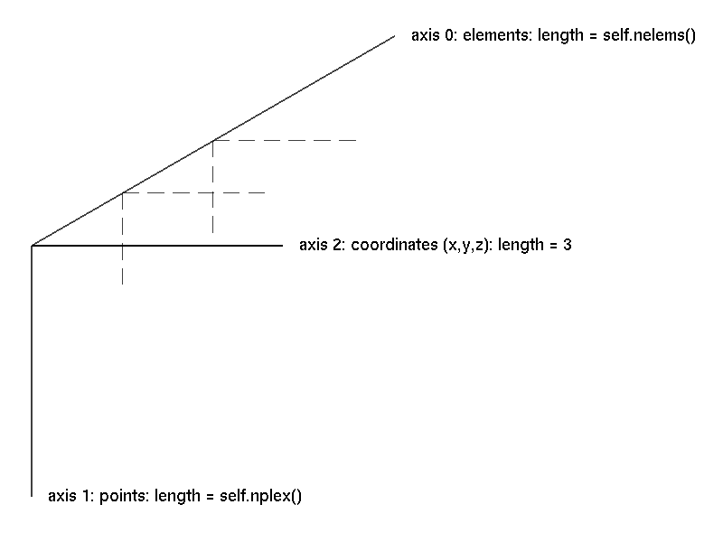
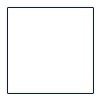
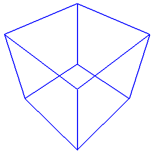
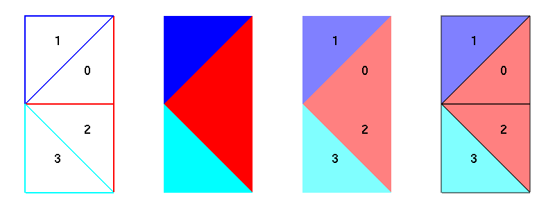
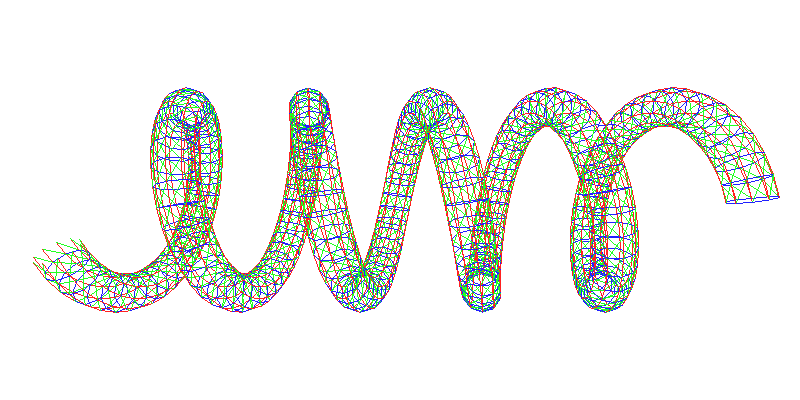

.. $Id$
  
..
  This file is part of pyFormex 0.8.5  (Sun Dec  4 21:24:46 CET 2011)
  pyFormex is a tool for generating, manipulating and transforming 3D
  geometrical models by sequences of mathematical operations.
  Home page: http://pyformex.org
  Project page:  http://savannah.nongnu.org/projects/pyformex/
  Copyright 2004-2011 (C) Benedict Verhegghe (benedict.verhegghe@ugent.be)
  Distributed under the GNU General Public License version 3 or later.
  
  
  This program is free software: you can redistribute it and/or modify
  it under the terms of the GNU General Public License as published by
  the Free Software Foundation, either version 3 of the License, or
  (at your option) any later version.
  
  This program is distributed in the hope that it will be useful,
  but WITHOUT ANY WARRANTY; without even the implied warranty of
  MERCHANTABILITY or FITNESS FOR A PARTICULAR PURPOSE.  See the
  GNU General Public License for more details.
  
  You should have received a copy of the GNU General Public License
  along with this program.  If not, see http://www.gnu.org/licenses/.
  
  

.. include:: defines.inc
.. include:: gui.inc
.. include:: links.inc

.. _cha:tutorial:

*****************
pyFormex tutorial
*****************

.. topic:: Abstract

   This tutorial will guide you step by step through the most important
   concepts of the pyFormex scripting language and the pyFormex Graphical
   User Interface (GUI). It is intended for first time users, giving explicit
   details of what to do and what to expect as result.
   

.. _sec:intro-tut:

The philosophy
==============

pyFormex is a Python implementation of Formex algebra. Using
pyFormex, it is very easy to generate large geometrical models of 3D
structures by a sequence of mathematical transformations.  It is
especially suited for the automated design of spatial structures. But
it can also be used for other tasks, like operating on 3D geometry
obtained from other sources, or for finite element pre- and
postprocessing, or just for creating some nice pictures.

By writing a simple script, a large and complex geometry can be created by
copying, translating, rotating, or otherwise transforming geometrical entities.
pyFormex will interpret the script and draw what you have created. 
This is clearly very different from the traditional (mostly interactive) way
of creating a geometrical model, like is done in most CAD packages.
There are some huge advantages in using pyFormex:

* It is especially suited for the automated design of spatial frame structures.
  A dome, an arc, a hypar shell, ..., when constructed as a space frame, can be
  rather difficult and tedious to draw with a general CAD program; 
  using scripted mathematical transformations however, it may become a
  trivial task.

* Using a script makes it very easy to apply changes in the geometry:
  you simply modify the script and re-execute it. You can easily
  change the value of a geometrical parameter in any way you want:
  set it directly, interactively ask it from the user, calculate it from some
  formula, read it from a file, etcetera. 
  Using CAD, you would have often have to
  completely redo your drawing work. The power of scripted geometry
  building is illustrated in figure :ref:`fig:scallopdomes`: all these
  domes were created with the same script, but with different values
  of some parameters.

.. _`fig:scallopdomes`:

   Same script, different domes

* At times there will be operations that are easier to perform through
  an interactive Graphical User Interface (GUI). The GUI gives access
  to many such functions. Especially occasional and untrained users
  will benefit from it. As everything else in pyFormex, the GUI is completely
  open and can be modified at will by the user's application scripts,
  to provide an interface with either extended or restricted
  functionality. 

* \pyformex scripts are written in the `Python`_ programming language.
  This implies that the scripts are also Python-based. It is a very
  easy language to learn, and if you are interested in reading more
  about it, there are good tutorials and beginner's guides available
  on the Python website (http://www.python.org/doc). However, if
  you're only using Python to write pyFormex scripts, the tutorial
  you're reading right now should be enough.

.. _sec:getting-started:

Getting started
===============

* Start the pyFormex GUI by entering the command ``pyformex`` in a
  terminal. Depending on your instalation, there may also be a menu
  item in the application menu to start pyFormex, or even a quickstart button
  in the panel. Using the terminal however can still be useful,
  especially in the case of errors, because otherwise the GUI might
  suppress some of the error messages that normally are sent to the
  terminal.

* Create a new pyFormex script using the
  :menuselection:`File-->Create new script` option, and enter a filename
  with extension ``.py``. This will open up your favorite editor with
  a pyFormex script template like the one below.

  .. literalinclude:: static/scripts/template.py
     :linenos:

.. note:: If the editor does not open, you may need to configure
   the editor command:  see :ref:`Settings --> Commands <settings-commands>`.

   Make sure you are using an editor that understands Python code. Most modern
   editors will give you syntax highlighting and help with indentation.

* The template script shows the typical layout of a pyFormex script:

  - The script starts with a line ``#!/usr/bin/env pyformex``.
  - Then comes a multiline documentation string, contained between two ``"""`` 
    delimiters. Read it: it repeats this instructions on how a legal
    pyFormex script should be structured.
  - Next are the pyFormex instructions: in this case there's only one line.
  - The script ends with a comment line ``# End``. We recommend you to do this
    also. It serves as a warning for inadvertent truncation of your file.

* In the status bar at the bottom of the pyFormex GUI, you will now
  see the name of the script, together with a green dot. This tells
  you that the script has been recognized by the system as a
  pyFormex script, and is ready to run.

* Execute the script by selecting the :menuselection:`File --> Play`
  menu option, or by just pushing the |button-play| button in the
  toolbar. In the message area just above the status bar, a line is
  printed announcing the start and end of execution. Any output created
  by the script during execution will be displayed in between this two
  lines. As expected, the template script just prints the text from line 16
  of the script.

* Now change the text of the string in line 16, but do not save your changes.
  Execute the script again, and notice that the printed text has not changed!
  This is because the editor is an external program to pyFormex, and *the 
  executed script is always the text as read from file*, not necessarily equal
  to what is displayed in your editor.

  Save the script, run it again, and you will see the output has changed.

* Next, change the text of the script to look like the one below, and save it as
  ``example1.py``. Again, note that the editor and pyFormex are separate 
  programs, and saving the script does not change the name of the current
  script in pyFormex.

  Selecting an existing script file for execution in pyFormex is done with
  the :menuselection:`File --> Open` option. Open the ``example1.py`` file
  you just saved and check that its name is indeed displayed in the status bar.
  You can now execute the script if you want, but it will not produce anything
  visible. We'll learn you how to visualize geometry later on.

  .. literalinclude:: static/scripts/example1.py
     :linenos:

* Exit |pyFormex| (using the :menuselection:`File --> Exit`) and then restart
  it. You should again see the ``example1.py`` displayed as the current script.
  On exit, pyFormex stores your last script name, and on restart it prepares
  to run it again. You can also easily select one the most recent scripts you
  used from the :menuselection:`File --> History` option. Select the oldest
  (bottom) one. Then close all your editor windows.

* Open the ``example1.py`` again, either using :menuselection:`File --> Open`
  or :menuselection:`File --> History`. The script will not be loaded into your
  editor. That is becaused often you will just want to *run* the script, not
  *change* it. Use the :menuselection:`File --> Edit` option to load the
  current script into the editor.

Now that you know how to load, change and execute scripts in pyFormex, we're
all set for exploring its power. But first, let's introduce you to
some basic Python and NumPy concepts. If you are already familiar with
them, you can just skip these sections. 

.. _sec:intro-python:

Some basic Python concepts
==========================

pyFormex is written in the Python language, and Python is also the
scripting language used by pyFormex. Since the whole intent of pyFormex
is to generate geometrical structures from scripts, you will at least
need to have some basic knowledge of Python before you can use it for
your own projects.

The `Python documentation`_ website contains a variety of good
documents to introduce you. If you are new to Python, but have already
some programming experience, the `Python tutorial`_ may be a good
starting point. Or else, you can take a look at one of the other beginners'
guides. Stick with the Python 2.x documentation for now. Though
pyFormex might one day use Python 3.x, we are still far off that
day, because all the underlying packages need to be converted to
Python 3 first.

Do not be afraid of having to learn a new programming language. Python is
known as own of the easiest languages to get started with: just a few basic
concepts suffice to produce quite powerful scripts. Most developers and users of
pyFormex have started without any knowledge of Python.

For the really impatient who do not want to go through the `Python
tutorial`_ before diving into pyFormex, we have gathered hereafter
some of the most important Python concepts, hopefully enabling you to
continue with this tutorial.

Here is a small example Python script.
    
.. literalinclude:: static/scripts/python_intro.py
   :linenos:

* A '#' starts a comment: the '#', and anything following it on the same line,
  is disregarded. A Python script typically starts with a comment line like
  line 1 of the above script.

* Strings in Python can be delimited either by single quotes ('),
  double quotes (") or by triple double quotes ("""). The starting and
  ending delimiters have to be equal though. Strings in triple quotes
  can span several lines, like the string on lines 2-5.

* Indentation is essential. Indentation is Python's way of
  grouping statements. In small, sequential scripts,
  indentation is not needed and you should make sure that you start
  each new line in the first column.
  An ``if`` test or a ``for`` loop will however need indentation to
  mark the statement(s) inside the condition or loop.
  Thus, in the example, lines 8-15 are the block of statements that are
  executed repeatedly under the ``for`` loop construct in line 7.
  Notice that the condition and loop statements end with a ':'.

  You should make sure that statements belonging to the same block are
  indented consistently.
  We advice you not to use tabs for indenting. A good practice
  commonly followed by most Python programmers is to indent with 4
  spaces. 

  The indentation makes Python code easy to read for humans. Most modern
  editors will recognize Python code and help you with the indentation.

* Variables in Python do not need to be declared before using them. In
  fact, Python has no variables, only typed objects. An assignment is
  just the binding of a name to an object. That binding can be changed
  at each moment by a new assignment to the same name.
   
* Sequences of objects can be grouped in tuples or lists, and
  individual items of them are accessed by an index starting from 0.

* Function definitions can use both positional arguments and keyword arguments,
  but the keyword arguments must follow the positional arguments.
  The order in which keyword arguments are specified is not important.

* You can use names defined in other modules, but you need to import
  those first. This can be done by importing the whole module and then
  using a name relative to that module::

   import mymodule
   print mymodule.some_variable

  or you can import specific names from a module::

   from mymodule import some_variable
   print some_variable

  or you can import everything from a module (not recommended, because
  you can easily clutter your name space)::

   from mymodule import *
   print some_variable

.. _sec:intro-numpy:

Some basic NumPy concepts
=========================

.. warning:: This section still needs to be written!

Numerical Python (or NumPy for short) is an extension to the Python language
providing efficient operations on large (numerical) arrays. relies heavily on
NumPy, and most likely you will need to use some NumPy functions in your
scripts. As NumPy is still quite young, the available documentation is not so
extensive yet. Still, the tentative NumPy
tutorial http://www.scipy.org/Tentative_NumPy_Tutorial already provides the
basics.

If you have ever used some other matrix language, you will find a lot of similar
concepts in NumPy.

To do: Introduce the (for users) most important NumPy concepts.

.. index:: single: ndarray

pyFormex uses the NumPy :class:`ndarray` as implementation of fast 
numerical arrays in Python.

.. _sec:formex:

The Formex data model
=====================

.. index::
   single: Formex
   single: plexitude

The most important geometrical object in pyFormex is the
:class:`Formex` class. A :class:`Formex` (plural:Formices) can
describe a variety of geometrical objects: points, lines, surfaces,
volumes. The most simple geometrical object is the point, which in
three dimensions is only determined by its coordinates ``(x,y,z)``,
which are numbered ``(0,1,2)`` in pyFormex to be consistent with
Python and NumPy indexing.  Higher order geometrical objects are
defined as a collection of points.  The number of points of an object
is called the *plexitude* of the object.

.. index:: single: element

A Formex is a collection of geometrical objects of the same plexitude. The
objects in the collection are called the *elements* of the :class:`Formex`. A
:class:`Formex` whose elements have plexitude :math:`n` is also called an
:math:`n`\ -plex :class:`Formex`. Internally, the coordinates of the points are
stored in a NumPy :class:`ndarray`  with three dimensions. The coordinates of a
single point are stored along the last axis (2) of the :class:`Formex`; all the
points of an element are stored along the second axis (1); different elements
are stored along the first axis (0) of the :class:`Formex`. The figure
:ref:`fig:formex` schematizes the structure of a :class:`Formex`.

.. _`fig:formex`:

   The structure of a Formex

.. warning::

   The beginning user should be aware not to confuse the three axes of
   a :class:`Formex` with the axes of the 3D space. Both are numbered
   0..2. The three coordinate axes form the components of the last
   axis of a Formex.

For simplicity of the implemented algorithms, internally pyFormex
only deals with 3D geometry. This means that the third axis of a
:class:`Formex` always has length 3. You can however import 2D
geometry: all points will be given a third coordinate
:math:`z=0.0`. If you restrict your operations to transformations in
the :math:`(x,y)`\ -plane, it suffices to extract just the first two
coordinates to get the transformed 2D geometry.

The :class:`Formex` object ``F`` can be indexed just like a :math:`NumPy`
numerical array: ``F[i]`` returns the element with index :math:`i` (counting
from :math:`0`). For a :class:`Formex` with plexitude :math:`n`, the result will
be an array with shape :math:`(n,3)`, containing all the points of the element.
Further, ``F[i][j]`` will be a :math:`(3,)`\ -shaped array containing the
coordinates of point :math:`j` of element :math:`i`. Finally, ``F[i][j][k]`` is
a single floating point value representing one coordinate of that point.

In the following sections of this tutorial, we will first learn you
how to create simple geometry using the Formex data model and how to
use the basic pyFormex interface functions. The real power of the
:class:`Formex` class will then be established starting from the section :ref:`sec:transform`.
 

.. _sec:create_formex:

Creating a Formex
=================

There are many, many ways to create :class:`Formex` instances in your
scripts.  Most of the geometrical operations and transformations in
pyFormex return geometry as a :class:`Formex`. But how do you create
a new geometric structure from simple coordinate data? Well, there are
several ways to do that too, and we'll introduce them one by one.

.. _subsec:direct_input:

Direct input of structured coordinate data
^^^^^^^^^^^^^^^^^^^^^^^^^^^^^^^^^^^^^^^^^^

The most straightforward way to create a Formex is by directly
specifying the coordinates of the points of all its elements in a way
compatible to creating a 3D :class:`ndarray`::

   F = Formex([[[0.,0.],[1.,0.]],[[1.,1.],[0.,1.]]])

The data form a nested list of three levels deep. Each innermost level list
holds the coordinates of a single point. There are four of them: [0.,0.], [1.,0.], [1.,1.] and [0.,1.]. Remark that we left out the third (z) coordinate and it will be set equal to zero. Also, though the values are integer, we added a dot
to force floating point values.

.. warning:: Python by default uses integer math on integer arguments!
   We advice you to always write the decimal point in values that initialize
   variables that can have floating point values, such as lengths, angles,
   thicknesses. Use integer values only to initialize variables that can
   only have an integer value, such as the number of elements.

The second list level groups the points into elements. In this case
there are two elements, each containing two points. The outermost list
level then is the :class:`Formex`: it has plexitude 2 and contains 2
elements.  But what geometrical entities does this represent? The
plexitude alone does not specify what kind of geometric objects we are
dealing about. A 2-plex element would presumably represent a straight
line segment between two points in space, but it could just as well be
used to represent a sphere (by its center and a point on the surface)
or a plane (by a point in the plane and the direction of the normal).

By default, pyFormex will interprete the plexitude as follows:

============== ===============================
Plexitude      Geometrical interpretation
============== ===============================
1              Points
2              Straight line segments
3              Triangles 
4 or higher    Polygons (possibly nonplanar) 
============== ===============================

  
We will see later how to override this default. For now, let's draw Formices
with the default. Go back to the ``example1.py`` script in your editor, containing the line above, and add the ``draw(F)`` instruction to make it look like::

   F = Formex([[[0.,0.],[1.,0.]],[[1.,1.],[0.,1.]]])
   draw(F)

Save the script and execute it in pyFormex. You will see the following picture
appear in the canvas.

.. _`fig:parallel`:

   Two parallel lines

Now let's remove the two central ']' and '[' brackets in the first line::

   F = Formex([[[0.,0.],[1.,0.],[1.,1.],[0.,1.]]])
   draw(F,color=blue)

With the same data we have now created a 4-plex Formex with only one element.
Execute the script again (do not forget to save it first) and you will see
a square. Note that the draw command allows you to specify a color.  

.. _`fig:square`:

   A square.

But wait a minute! Does this represent a square surface, or just the four lines constituting the circumference of the square? Actually, it is a square surface, but since the pyFormex GUI by default displays in wireframe mode, unless you have changed it, you will only see the border of the square. You can make surfaces and solids get fully rendered by selecting the :menuselection:`Viewport --> Render Mode --> Flat` option or using the shortcut |button-flat| button in the toolbar.
You will then see 

.. _`fig:square-filled`:

   The square in smooth rendering.

pyFormex by default uses wireframe rendering, because in a fully
rendered mode many details are obscured. Switch back to wireframe
mode using the :menuselection:`Viewport --> Render Mode -->
Wireframe` menu option or |button-wireframe| toolbar button.

Now suppose you want to define a Formex representing the four border
lines of the square, and not the surface inside that
border. Obviously, you need a 4 element 2-plex Formex, using data
structured like this::

   F = Formex([[[0.,0.],[0.,1.]], [[0.,1.],[1.,1.]], [[1.,1.],[1.,0.]], [[1.,0.],[0.,0.]]])
   draw(F,color=blue,clear=True)

Try it, and you will see an image identical to the earlier figure
:ref:`fig:square`. 
But now this image represents four straight lines, while the same
image formerly represented a square plane surface.

.. warning:: When modeling geometry, always be aware that what you
   think you see is not necessarily what it really is!

The ``clear=True`` option in the draw statement makes sure the screen
is cleared before drawing. By default the pyFormex draw
statement does not clear the screen but just adds to what was already
drawn. You can make the ``clear=True`` option the default from the
:menuselection:`Viewport --> Drawing Options` menu.  Do this now before continuing.

Changing the rendering mode, the perspective and the viewpoint can
often help you to find out what the image is really representing.
But interrogating the Formex data itself is the definite way to make sure::

   F = Formex([[[0.,0.],[1.,0.],[1.,1.],[0.,1.]]])
   print F.shape()
   F = Formex([[[0.,0.],[1.,0.]],[[1.,1.],[0.,1.]]])
   print F.shape()

This will print the length of the three axes of the coordinate array. In
the first case you get ``(1, 4, 3)`` (1 element of plexitude 4),
while the second one gives ``(2, 2, 3)`` (2 elements of plexitude 2).

You can also print the whole Formex, using ``print F``, giving you the
coordinate data in a more readable fashion than the list input. The
last example above will yield:
``{[0.0,0.0,0.0; 1.0,0.0,0.0], [1.0,1.0,0.0; 0.0,1.0,0.0]}``.
In the output, coordinates are separated by commas and points by
semicolons. Elements are contained between brackets and the full
Formex is placed inside braces.

Until now we have only dealt with plane structures, but 3D structures
are as easy to create from the coordinate data. The following Formex
represents a pyramid defined by four points (a tetrahedron)::

   F = Formex([[[0.,0.,0.],[1.,0.,0.],[0.,1.,0.],[0.,0.,1.]]],eltype='tet4')
   draw(F)

Depending on your current rendering mode, this will produce an image
like one of the following:

.. _`fig:tetraeder`:

   The tetrahedron in wireframe and smoothwire (transparent) rendering

The smoothwire mode can be set from the :menuselection:`Viewport -->
Render Mode --> Smoothwire` option or the |button-smoothwire|
button. The transparent mode can be toggled using the |button-transparent|
button.

Hold down the left mouse button and move the mouse: the pyramid will
rotate. In the same way, holding down the rigth button will zoomin and
out. Holding down the middle button (possibly the mouse wheel, or the
left and right button together) will move the pyramid over the canvas.
Practice a bit with these mouse manipulations, until you get a feeling of what
they do.
All these mouse operations do not change the coordinates of the
structure: they just change the way you're looking at it. You can
restore the default view with the :menuselection:`Views --> Front`
menu or the |button-front| button. 

The default installation of pyFormex provides seven default views:
``Front``, ``Back``, ``Left``, ``Right``, ``Top``, ``Bottom`` and
``Iso``. They can be set from the :menuselection:`Views` menu items or
the corresponding view buttons in the toolbar.  The default ``Front``
corresponds to the camera looking in the :math:`-z` direction, with
the :math:`x` axis oriented to the right and the :math:`y` axis
upward.

We explicitely added the element type ``tet4`` when creating the
pyramid. Without it, pyFormex would have interpreted the 4-plex Formex
as a quadrilateral (though in this case a non-planar one).

.. _subsec:using_patterns:

Using the :func:`pattern` or :func:`mpattern` functions
^^^^^^^^^^^^^^^^^^^^^^^^^^^^^^^^^^^^^^^^^^^^^^^^^^^^^^^
In the previous examples the Formices were created by directly
specifying the coordinate data. That is fine for small structures, but
quickly becomes cumbersome when the structures get larger.
The :func:`pattern` and :func:`mpattern` functions reduce the amount of
input needed to create a Formex from scratch.

Both functions create a series of points from a simple
string. Each character of the string is interpreted either as a unit
step in one of the coordinate directions, or as some other simple
action. These functions are thus very valuable in creating geometry
where the points lie on a regular grid.

The first point of the list is [0,0,0]. Each character from the input
string is interpreted as a code specifying how to move to the next
point.  Currently defined are the following codes: 0 = goto origin
[0,0,0], 1..8 move in the x,y plane, 9 remains at the same place.
When looking at the plane with the x-axis to the right and the y-axis
up, 1 = East, 2 = North, 3 = West, 4 = South, 5 = NE, 6 = NW, 7 = SW,
8 = SE.
Adding 16 to the ordinal of the character causes an extra move of +1 in the
z-direction. Adding 48 causes an extra move of -1. This means that
'ABCDEFGHI', resp. 'abcdefghi', correspond with '123456789' with an
extra z = +/- 1. This gives the following schema::

                 z+=1             z unchanged            z -= 1
            
             F    B    E          6    2    5         f    b    e 
                  |                    |                   |     
                  |                    |                   |     
             C----I----A          3----9----1         c----i----a  
                  |                    |                   |     
                  |                    |                   |     
             G    D    H          7    4    8         g    d    h
             
The special character '/' can be put before any character to make the
move without making a connection.  The effect of any other character
is undefined.

The :func:`pattern` function creates a straight line segment between
each pair of subsequent points, and thus results in a 2-plex Formex.
Here's an example::

   F = Formex(pattern('1234'))
   draw(F)

It creates the same circumference of a unit square as above (see
figure :ref:`fig:square`), but is much simpler than the explicit 
specification of the coordinates we used before.
Figure :ref:`fig:patterns` shows some more examples. 

.. _`fig:patterns`:

   Images generated from the patterns '127', '11722' and '22584433553388'

The :func:`mpattern` function is more general than :func:`pattern` in that it allows the
creation of Formices of any plexitude. Each subsequent point is added
to the same element, until a '-' character or the end of the string is
found. The following example creates a square::

   F = Formex(mpattern('123'))
   draw(F)

If it comes as a surprise that there are only 3 characters for a
square, remember that the origin is always added as first point.

Some simple wireframe patterns are defined in :mod:`simple.py` and are
ready for use.  These pattern strings are stacked in a dictionary called
'Pattern'. Items of this dictionary can be accessed like
``Pattern['cube']``. They still need to be processed by the
:func:`pattern` function to produce coordinates::

   #!/usr/bin/env pyformex
   from simple import Pattern
   F = Formex(pattern(Pattern['cube']))
   print F.shape()
   draw(F,color=blue,view='iso')

.. _`fig:cube`:

   A wireframe cube

The printed out shape of the Formex is ``(12,2,3)``, confirming that
what we have created here is not a 3D solid cube, nor the planes bounding
that cube, but merely twelve straight line segments forming the edges
of a cube. 

The ``view='iso'`` option in the draw statement rotates the camera so
that it looks in the [-1,-1,-1] direction. This is one of the
predefined viewing directions and can also be set from the
:menuselection:`Views` menu or using the |button-iso| button.

While the :func:`pattern` and :func:`mpattern` functions can
only generate points lying on a regular cartesian grid, pyFormex provides
a wealth of transformation functions to move the points to other
locations after they were created. 
Also, the :mod:`Turtle` plugin module provides a more general mechanism to
create planar wireframe structures.
  

.. _subsec:reading_from_file_or_string:

Reading coordinates from a file or a string
^^^^^^^^^^^^^^^^^^^^^^^^^^^^^^^^^^^^^^^^^^^
Sometimes you want to read the coordinates from a file, rather
than specifying them directly in your script.
This is especially handy
if you want to import geometry from some other program that can not
export data in a format that is understood by pyFormex. There usually is a
way to write the bare coordinates to a file, and the pyFormex
scripting language provides all the necessary tools to read them back.

As an example, create (in the same folder where you store your
scripts) the text file ``square.txt`` with the following contents::

   0, 0, 0,  0, 1, 0,  1, 1, 0,  1, 0, 0,
   1, 1, 0,  2, 1, 0,  2, 2, 0,
   1, 2, 0

Then create and execute the following script. ::

   #!/usr/bin/env pyformex
   chdir(__file__)
   F = Formex.fromfile('square.txt',sep=',',nplex=4)
   draw(F)

It will generate two squares, as shown in the figure :ref:`fig:twosquares`. 

.. _`fig:twosquares`:

   Two squares with coordinates read from a file

The ``chdir(__file__)`` statement sets your working
directory to the directory where the script is located, so that the filename
can be specified without adding the full pathname.
The :meth:`Formex.fromfile` call reads the coordinates (as specified,
separated by ',') from the file and groups them into elements of the specified
plexitude (4). The grouping of coordinates on a line is irrelevant:
all data could just as well be given on a single line, or with just one value
per line. The separator character can be accompanied by extra
whitespace. Use a space character if your data are only separated by
whitespace. 

There is a similar :meth:`Formex.fromstring` method, which reads
coordinates directly from a string in the script. 
If you have a lot of coordinates to specify, this may be far more easy
than using the list formatting. 
The following script yields the same result as the above one::

   #!/usr/bin/env pyformex
   F = Formex.fromstring("""
   0 0 0  0 1 0  1 1 0  1 0 0
   1 1 0  2 1 0  2 2 0  1 2 0
   """,nplex=4)
   draw(F)

Here we used the default separator, which is a space.

.. note :: Make sure to use :meth:`Formex.fromfile`, to distinguish it from
           :meth:`Coords.fromfile` and :meth:`numpy.fromfile`.

.. _sec:concatenation_and _lists:

Concatenation and lists of Formices
===================================

Multiple Formices can be concatenated to form one new Formex. There
are many ways to do this, but the simplest is to use the '+' or
``+=`` operator. Notice the diffference: the ``+`` operator does not
changing any of the arguments, but the ``+=`` operator adds the second
argument to the first, changing its definition::

   F = Formex(pattern('1234'))
   G = Formex(pattern('5'))
   H = F + G
   draw(H)

displays the same Formex as::

   F += G
   draw(F)

but in the latter case, the original definition of ``F`` is lost.

The ``+=`` operator is one of the very few operations that
change an existing Formex. Nearly all other operations return a
resulting Formex without changing the original ones.

Because a Formex has a single plexitude and element type,
concatenation is restricted to Formices of the same plexitude and with
the same :attr:`eltype`. If you want to handle structures with
elements of different plexitude as a single object, you have to group
them in a list::

   F = Formex(pattern('1234'))
   G = Formex([0.5,0.5,0.])
   H = [F,G]
   draw(H,color=red)

This draws the circumference of a unit square (F: plexitude 2) and the
center point of the square (G: plexitude 1), both in red.

.. _`fig:square_center`:

   A square and its center point.

.. _sec:propnr:

Formex property numbers
=======================

Apart from the coordinates of its points, a :class:`Formex` object can
also store a set of property numbers. This is a set of integers, one
for every element of the Formex. The property numbers are stored in an
attribute :attr:`prop` of the Formex.  They can be set, changed or
deleted, and be used for any purpose the user wants, e.g. to number
the elements in a different order than their appearence in the
coordinate array. Or they can be used as pointers into a large
database that stores all kind of properties for that element. Just
remember that a Formex either has no property numbers, or a complete
set of numbers: one for every element.

Property numbers can play an important role in the modeling process, because
they present some means of tracking how the resulting Formex was created.
Indeed, each transformation of a Formex that preserves its structure, will also
preserve the property numbers. Concatenation of Formices with property numbers
will also concatenate the property numbers. If any of the concatenated Formices
does not have property numbers, it will receive value 0 for all its elements. If
all concatenated Formices are without properties, so will be the resulting
Formex.

On transformations that change the structure of the Formex, such as
replication, each element of the created Formex will get the property
number of the Formex element it was generated from.

To add properties to a Formex, use the
:meth:`setProp` method. It ensures that the property array is generated with
the correct type and shape. If needed, the supplied values are repeated to
match the number of elements in the Formex. 
The following script creates four triangles, the first and third get
property number 1, the second and fourth get property 3.::

   F = Formex(mpattern('12-34-14-32'))
   F.setProp([1,3])
   print F.prop   # --> [1 3 1 3]

As a convenience, you can also specify the property numbers as a
second argument to the Formex constructor.
Once the properties have been created, you can safely change
individual values by directly accessing the :attr:`prop` attribute::

   F = Formex(mpattern('12-34-14-32'),[1,3])
   F.prop[3] = 4
   print(F.prop)   # --> [1 3 1 4]
   draw(F)
   drawNumbers(F)

When you draw a Formex with property numbers using the default draw
options (i.e. no color specified), pyFormex will use the property
numbers as indices in a color table, so different properties are shown
in different colors. The default color table has eight colors: 
``[black, red, green, blue, cyan, magenta, yellow, white]`` and will wrap
around if a property value larger than 7 is used. You can however
specify any other and larger colorset to be used for drawing the
property colors. The following figure shows different renderings
of the structure created by the above script. The :func:`drawNumbers`
function draws the element numbers (starting from 0).  

.. _`fig:props`:

   A Formex with property numbers drawn as colors. From left to right:
   wireframe, flat, flat (transparent), flatwire (transparent).

In flat rendering mode, the element numbers may be obscured by the
faces. In such case, you can make the numbers visible by using the
transparent mode, which can be toggled
with the |button-transparent| button. 

Adding properties to a Formex is often done with the sole purpose of
drawing with multiple colors. But remember you are free to use the properties
for any purpose you want. You can even save, change and restore them
throughout the lifetime of a Formex object, thus you can attibrute
multiple property sets to a Formex.

.. _sec:formex_info:

Getting information about a Formex
==================================

While the visual feedback on the canvas usually gives a good
impression of the structure you created, at times the view will not
provide enough information or not precise enough. Viewing a 3D
geometry on a 2D screen can at times even be very misleading. The most
reliable source for checking your geometry will always be the Formex
data itself. We have already seen that you can print the coordinates
of the Formex ``F``
just by printing the Formex itself: ``print(F)``. 
Likewise you can see the property numbers from a ``print(F.prop)`` instruction.

But once you start using large data structures, this information may become difficult to handle.
You are usually better off with some generalized information about the Formex object.
The :class:`Formex` class provides a number of methods that return such information.
The following table lists the most interesting ones.

+--------------------+----------------------------------------------+
| Function           | Return value                                 |
+====================+==============================================+
| :meth:`F.nelems()` | The number of elements in the Formex         |
+--------------------+----------------------------------------------+
| :meth:`F.nplex()`  | The plexitude of the Formex (the number      |
|                    | of points in each element of the Formex)     |
+--------------------+----------------------------------------------+
| :meth:`F.bbox()`   | The bounding box of the Formex               |
+--------------------+----------------------------------------------+
| :meth:`F.center()` | The center of the bbox of the Formex         |
+--------------------+----------------------------------------------+
| :meth:`F.sizes()`  | The size of the bbox of the Formex           |
+--------------------+----------------------------------------------+
 

.. _sec:saving_images:

Saving images
=============

Often you will want to save an image of the created geometry to a
file, e.g. to include it in some document. This can readily be done
from the :menuselection:`File --> Save Image` menu. You just have to
fill in the file name and click the :guilabel:`Save` buttton. 
You can specify the file format by using the appropriate extension in
the file name. The default and recommended format is ``png``, but
pyFormex can save in commonly used bitmap formats like ``jpg`` or
``gif`` as well. 
If you have installed ``gl2ps`` (see :ref:`subsec:development-version`), you can even save in a number of
vector formats, such as ``eps`` or ``svg``.

But you can also create the images from inside your script. Just
import the ``image`` module and call the ``image.save()`` function::
   
   import gui.image
   image.save("my_image.png")

Often you will want to change some settings, like rendering mode or
background color, to get a better looking picture.
Since the main goal of pyFormex is to automate the creation and
transformation of geometrical models, all these settings can be
changed from inside your script as well. 
The following code was used to create the four images in 
figure :ref:`fig:props` above.

::

   import gui.image
   chdir(__file__)
   reset()
   bgcolor(white)
   linewidth(2)
   canvasSize(200,300)
   F = Formex(mpattern('12-34-14-32'),[1,3])
   F.prop[3] = 4
   clear()
   draw(F)
   drawNumbers(F)
   wireframe()
   image.save('props-000.png')
   flat()
   transparent(False)
   image.save('props-001.png')
   transparent(True)
   image.save('props-002.png')
   flatwire()
   image.save('props-003.png')

The following table lists the interactive menu
option and the correspondant programmable function to be used to
change some of the most common rendering settings.

+--------------------+------------------------+------------------------------------------------+
| Purpose            | Function(s)            | Menu item                                      |
+====================+========================+================================================+
| Background color   | bgcolor()              | :menuselection:`Viewport --> Background Color` |
+--------------------+------------------------+------------------------------------------------+
| Line width         | linewidth()            | :menuselection:`Viewport --> LineWidth`        |
+--------------------+------------------------+------------------------------------------------+
| Canvas Size        | canvasSize()           | :menuselection:`Viewport --> Canvas Size`      |
+--------------------+------------------------+------------------------------------------------+
| Render Mode        | wireframe(),           | :menuselection:`Viewport --> Render Mode`      |
|                    | flat(), flatwire(),    |                                                |
|                    | smooth(), smoothwire() |                                                |
+--------------------+------------------------+------------------------------------------------+
| Transparency       | transparent()          |                                                |
+--------------------+------------------------+------------------------------------------------+

 

.. _sec:transform:

Transforming a Formex
=====================

Until now, we've only created simple Formices. The strength of
pyFormex however is the ease to generate large geometrical models by a sequence of
mathematical transformations. After creating a initial Formex, you can
transform it by creating copies, translations, rotations, projections,...

The :class:`Formex` class has an wide range of powerful transformation methods
available, and this is not the place to treat them all. The reference manual 
:doc:`refman` describes them in detail.

We will illustrate the power of the :class:`Formex` transformations by
studying one of the examples included with pyFormex. The
examples can be accessed from the :menuselection:`Examples` menu
option.

.. note:: If you have installed multiple script directories, the
   examples may be found in a submenu :menuselection:`Scripts -->
   Examples`.

When a script is selected from this menu, it will be executed
automatically. Select the :menuselection:`Examples --> Level -->
Beginner --> Helix` example. You will see an image of a complex
helical frame structure:

.. _`fig:helix`:

   A helical frame structure (Helix example)

Yet the geometry of this complex structure was built from the very
simple pyFormex script shown below (Use :menuselection:`File --> Edit
script` to load it in your editor.

.. literalinclude:: static/scripts/Helix.py
   :linenos:

The script shows all steps in the building of the helical structure. 
We will explain and illustrate them one by one.
If you want to see the intermediate results in pyFormex during
execution of the script, you can set a wait time between
subsequent drawing operations with :menuselection:`Settings --> Draw
Wait Time`. Or alternatively, you can start the script with the
|button-step| button: pyFormex will then halt before each ``draw``
function and wait until you push the |button-step| again.
 
The script starts (lines 3-4) with setting the two parameters ``m`` and ``n``. It is
always a good idea to put constants in a variable. That makes it easy to
change the values in a single place when you want to create another
structure:
`your model has become a parametric model.`

Lines 5 resets the drawing options to the defaults. It is not essential in this script but it is often a good idea to restore the defaults, in case they would have been changed by a script that was run previously.
Setting the ``clear=True`` option in line 6 makes sure the subsequent drawing instructions will remove the previous step from the canvas.

In line 7 we create the basic geometrical entity for this structure: a triangle consisting of three lines, which we give the properties 1, 2 and 3, so that the three lines are shown in a different color::

   F = Formex(pattern("164"),[1,2,3]) 

.. _`fig:helix-000`:

   The basic Formex

This basic Formex is copied ``m`` times with a translation step 1.0 (this is precisely the length
of the horizontal edge of the triangle) in the 0 direction::

   F = F.replic(m,1.,0)

.. _`fig:helix-001`:

   Replicated in x-direction

Then, the new  Formex
is copied ``n`` times  with the same step size in the direction 1. ::

   F = F.replic(n,1.,1)

.. _`fig:helix-002`:

   Replicated in y-direction

Now a copy of this last Formex is translated in direction '2' with a
translation step of '1'. This necessary for the transformation into a cylinder.
The result of all previous steps is a rectangular pattern with the desired
dimensions, in a plane z=1.  ::

   F = F.translate(2,1); drawit(F,'iso')

This pattern is rolled up into a cylinder around the 2-axis.

.. % \begin{figure}[ht]
.. % \centering
.. % \begin{makeimage}
.. % \end{makeimage}
.. % \begin{latexonly}
.. % \includegraphics[width=6cm]{images/spiral-003}
.. % \end{latexonly}
.. % \begin{htmlonly}
.. % \htmladdimg{../images/spiral-003.png}
.. % \end{htmlonly}
.. % \caption{The rectangular pattern}
.. % \end{figure}

::

   F = F.cylindrical([2,1,0],[1.,360./n,1.]); drawit(F,'iso')

This cylinder is copied 5 times in the 2-direction with a translation step of
'm' (the lenght of the cylinder).

.. % \begin{figure}[ht]
.. % \centering
.. % \begin{makeimage}
.. % \end{makeimage}
.. % \begin{latexonly}
.. % \includegraphics[width=6cm]{images/spiral-004}
.. % \end{latexonly}
.. % \begin{htmlonly}
.. % \htmladdimg{../images/spiral-004.png}
.. % \end{htmlonly}
.. % \caption{The cylinder}
.. % \end{figure}

::

   F = F.replic(5,m,2); drawit(F,'iso')

The next step is to rotate this cylinder -10 degrees around the 0-axis.  This
will determine the pitch angle of the spiral.  ::

   F = F.rotate(-10,0); drawit(F,'iso')

This last Formex is now translated in direction '0' with a translation step of
'5'.

.. % \begin{figure}[ht]
.. % \centering
.. % \begin{makeimage}
.. % \end{makeimage}
.. % \begin{latexonly}
.. % \includegraphics[width=6cm]{images/spiral-006}
.. % \end{latexonly}
.. % \begin{htmlonly}
.. % \htmladdimg{../images/spiral-006.png}
.. % \end{htmlonly}
.. % \caption{The new cylinder}
.. % \end{figure}

::

   F = F.translate(0,5); drawit(F,'iso')

Finally, the Formex is rolled up, but around a different axis then before.  Due
to the pitch angle, a spiral is created. If the pitch angle would be 0  (no
rotation of -10 degrees around the 0-axis), the resulting Formex  would be a
torus.   ::

   F = F.cylindrical([0,2,1],[1.,360./m,1.]); drawit(F,'iso')
   drawit(F,'right')

.. % \begin{figure}[ht]
.. % \centering
.. % \begin{makeimage}
.. % \end{makeimage}
.. % \begin{latexonly}
.. % \includegraphics[width=5cm]{images/spiral-007}
.. % \includegraphics[width=5cm]{images/spiral-008}
.. % \end{latexonly}
.. % \begin{htmlonly}
.. % \htmladdimg{../images/spiral-007.png}
.. % \htmladdimg{../images/spiral-008.png}
.. % \end{htmlonly}
.. % \caption{The spiral}
.. % \end{figure}

.. _sec:femodel:

Converting a Formex to a Mesh model
===================================

pyFormex contains other geometry models besides the Formex. The
:class:`Mesh` model e.g. is important in exporting the geometry to finite
element (FE) programs. A Formex often contains many points with (nearly) the
same coordinates. In a Finite Element model, these points have to be merged
into a single node, to express the continuity of the material. 
The :meth:`toMesh` method of a :class:`Formex`
performs exactly that. It returns a  :class:`Mesh` instance, which has
two import array attributes 'coords' and 'elems':

* coords is a float array with shape (ncoords,3), containing the
  coordinates of the merged points (nodes),

* elems is an integer array with shape (F.nelems(),F.nplex()), describing each
  element by a list of node numbers. These can be used as indices in
  the coords array to find the coordinates of the node.
  The elements and their nodes are in the same order as in F.

::

   from simple import *
   F = Formex(pattern(Pattern['cube']))
   draw(F)
   M = F.toMesh()
   print 'Coords',M.coords
   print 'Elements',M.elems

The output of this script are the coordinates of the unique nodes of
the Mesh, and the connectivity of the elements. The connectivity is an
integer array with the same shape as the first two dimensions of the
Formex: (F.nelems(),F.nplex())::

   Nodes
   [[ 0.  0.  0.]
    [ 1.  0.  0.]
    [ 0.  1.  0.]
    [ 1.  1.  0.]
    [ 0.  0.  1.]
    [ 1.  0.  1.]
    [ 0.  1.  1.]
    [ 1.  1.  1.]]
   Elements
   [[0 1]
    [1 3]
    [3 2]
    [2 0]
    [0 4]
    [1 5]
    [3 7]
    [2 6]
    [4 5]
    [5 7]
    [7 6]
    [6 4]]

The inverse operation of transforming a Mesh model back into a Formex
is also quite simple: ``Formex(nodes[elems])`` will indeed be identical to the
original F (within the tolerance used in merging of the nodes). ::

   >>> G = Formex(nodes[elems])
   >>> print allclose(F.f,G.f)
   True

The ``allclose`` funcion in the second line tests that all coordinates in both
arrays are the same, within a small tolerance.

.. End
