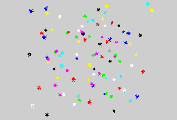
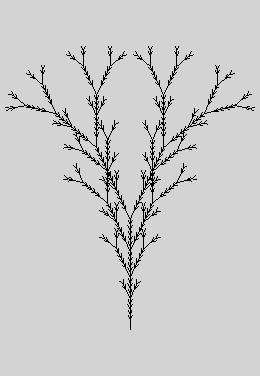
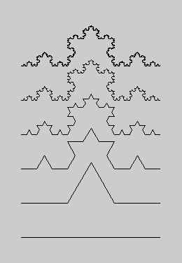
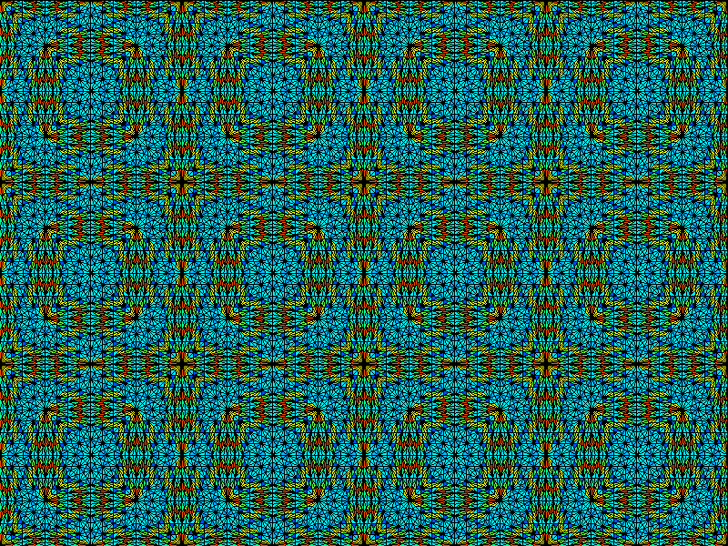

.. $Id$    -*- rst -*-
  
..
  This file is part of the pyFormex project.
  pyFormex is a tool for generating, manipulating and transforming 3D
  geometrical models by sequences of mathematical operations.
  Home page: http://pyformex.org
  Project page:  https://savannah.nongnu.org/projects/pyformex/
  Copyright (C) Benedict Verhegghe (benedict.verhegghe@ugent.be)
  Distributed under the GNU General Public License version 3 or later.
  
  
  This program is free software: you can redistribute it and/or modify
  it under the terms of the GNU General Public License as published by
  the Free Software Foundation, either version 3 of the License, or
  (at your option) any later version.
  
  This program is distributed in the hope that it will be useful,
  but WITHOUT ANY WARRANTY; without even the implied warranty of
  MERCHANTABILITY or FITNESS FOR A PARTICULAR PURPOSE.  See the
  GNU General Public License for more details.
  
  You should have received a copy of the GNU General Public License
  along with this program.  If not, see http://www.gnu.org/licenses/.
  
  

.. include:: <isonum.txt>
.. include:: ../defines.inc
.. include:: ../links.inc

Creating illustrations
======================
pyFormex can not only be used to create 3D geometry or operate on surface meshes. This page shows some examples where it was used just to create nice images.

Stars
-----
This collection of random stars was generated by the script shown below.

{colorize;../scripts/stars.py} 

.. _Lindenmayer: http://en.wikipedia.org/wiki/Lindenmayer_system

Illustrations using Lindenmayer_ systems
----------------------------------------
The following images were created using the *lima* plugin of pyFormex.

Carpet design
-------------
When working on implementing Mesh conversions in pyFormex, we came up
with a little fun script that starting from a simple grid, applies
subsequent random conversions and colorizes the final mesh elements based on some
geometric property. 
The resulting images were often of an amazing beauty and would serve very
well as design for carpets. The image hereafter e.g. was produced
from an initial rectangular grid of 4x3 squares and applying the following
series of transformations: 'tri3-x', 'tri6', 'tri3-4', 'quad4',
'tri3', 'tri6', 'tri3', 'tri3-4', 'tri6', 'quad4', 'tri3'. This
resulted in 27648 triangles which were then colored by aspect ratio.
The whole operation took pyFormex less than a second. 

A script for creating such random designs is included with the
pyFormex distribution, as the example named Carpetry.
Running this small script, you can create thousands of free designs a
day. So if you are a carpet manufacturer, you better fire your
designer and install pyFormex at no cost.

.. End
