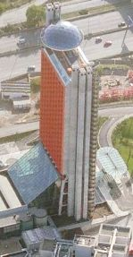
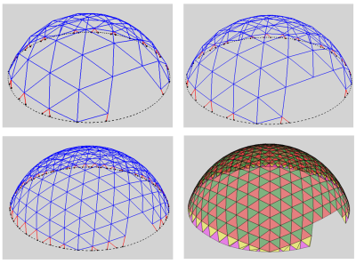
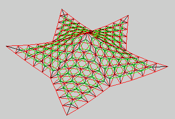
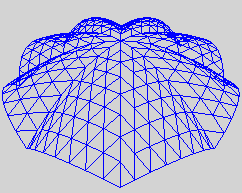
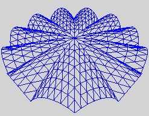
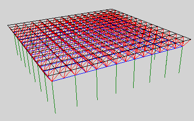
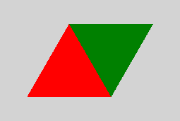
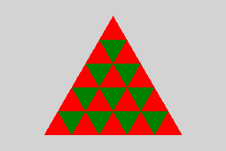
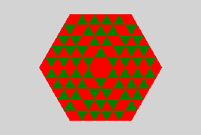
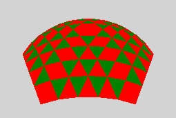

.. $Id$    -*- rst -*-
  
..
  This file is part of the pyFormex project.
  pyFormex is a tool for generating, manipulating and transforming 3D
  geometrical models by sequences of mathematical operations.
  Home page: http://pyformex.org
  Project page:  https://savannah.nongnu.org/projects/pyformex/
  Copyright (C) Benedict Verhegghe (benedict.verhegghe@ugent.be)
  Distributed under the GNU General Public License version 3 or later.
  
  
  This program is free software: you can redistribute it and/or modify
  it under the terms of the GNU General Public License as published by
  the Free Software Foundation, either version 3 of the License, or
  (at your option) any later version.
  
  This program is distributed in the hope that it will be useful,
  but WITHOUT ANY WARRANTY; without even the implied warranty of
  MERCHANTABILITY or FITNESS FOR A PARTICULAR PURPOSE.  See the
  GNU General Public License for more details.
  
  You should have received a copy of the GNU General Public License
  along with this program.  If not, see http://www.gnu.org/licenses/.
  
  

.. include:: <isonum.txt>
.. include:: ../defines.inc
.. include:: ../links.inc

Domes and frame structures
==========================

Hesperia dome
-------------

The Hesperia dome is a enormous construction made of glass on top of a
hotel in Barcelona. With pyFormex, a parametric 3D model of this dome
was created which allowed to evaluate geometric variations changing one
or more parameters (e.g. the span or height of a dome, the amount of
secondary triangles, etc.) as shown in the figure below. As
illustrated, geometries can be displayed in several ways
(e.g. wireframe, flat, smooth, transparent). Automated generation of
finite element input files can be incorporated in pyFormex.

  
Hyparcap
--------

A space frame in the form of a five-pointed star of hypars.

Scallop dome
------------

Example showing the parametric capabilities of pyFormex. Both domes
are createdby the same small script, by only changing two parameters.

SpaceTrussRoof
--------------

A space truss used for the roof of an industrial building.

Geodesic Dome
-------------

This example illustrates the use of surface elements. It shows four
steps in the creation of a geodesic dome.

First we create two triangles. We give them different colors so that
they are easy to distinguish::

   v=0.5*sqrt(3.)
   a = Formex([[[0,0],[1,0],[0.5,v]]],1)
   aa = Formex([[[1,0],[1.5,v],[0.5,v]]],2)

Next we copy the triangles a number of times in two directions,
generating the triangular pattern at the left::

   m=5; n=5
   d = a.replic2(m,min(m,n),1.,v,bias=0.5,taper=-1)
   dd = aa.replic2(m-1,min(m-1,n),1.,v,bias=0.5,taper=-1)

Then we copy-rotate the pattern into a hexagon::

    e = (d+dd).rosette(6,60,point=[m*0.5,m*v,0])

Lastly the pattern is mapped on a sphere, resulting in a geodesic dome
from which we give a perspective view::

   f = e.mapd(2,lambda d:0.8*sqrt((m+1)**2-d**2),e.center(),[0,1]) 

.. End
