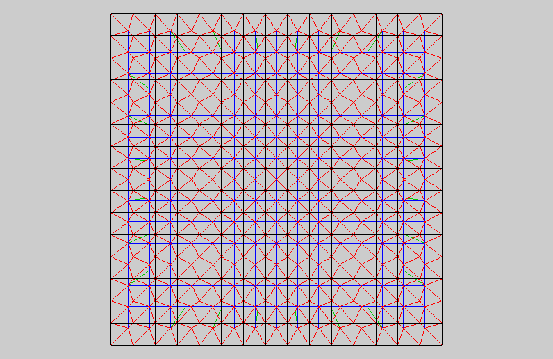

.. $Id$    -*- rst -*-
  
..
  This file is part of the pyFormex project.
  pyFormex is a tool for generating, manipulating and transforming 3D
  geometrical models by sequences of mathematical operations.
  Home page: http://pyformex.org
  Project page:  https://savannah.nongnu.org/projects/pyformex/
  Copyright (C) Benedict Verhegghe (benedict.verhegghe@ugent.be)
  Distributed under the GNU General Public License version 3 or later.
  
  
  This program is free software: you can redistribute it and/or modify
  it under the terms of the GNU General Public License as published by
  the Free Software Foundation, either version 3 of the License, or
  (at your option) any later version.
  
  This program is distributed in the hope that it will be useful,
  but WITHOUT ANY WARRANTY; without even the implied warranty of
  MERCHANTABILITY or FITNESS FOR A PARTICULAR PURPOSE.  See the
  GNU General Public License for more details.
  
  You should have received a copy of the GNU General Public License
  along with this program.  If not, see http://www.gnu.org/licenses/.
  
  

.. include:: <isonum.txt>
.. include:: defines.inc
.. include:: links.inc
 
.. index:: Gallery

Gallery
-------

This gallery is a collection of screenshots, illustrated examples,
videos and PDF documents of pyFormex setup and use in education and
research.

These documents have been collected over the past years of pyFormex
development and do not necessarily correspond to the latest version.
They may however still give you a good (though limited) impression of
what pyFormex can do for you.

.. toctree::
   :titlesonly:
   :maxdepth: 1

   applications
   screenshots
   videos
   pdfs

Want other examples?
....................
The pyFormex distribution (see the `Install manual <doc/install.html>`_) 
contains a wide collection of example scripts, 
with levels ranging from beginner to
advanced. Running these examples gives a nice overview of some
functionalities of pyFormex. 

As an extra bonus, here's a movie of a roof structure created by
pyFormex. 
Click the reload button of your browser to see the movie play (again).

.. End
